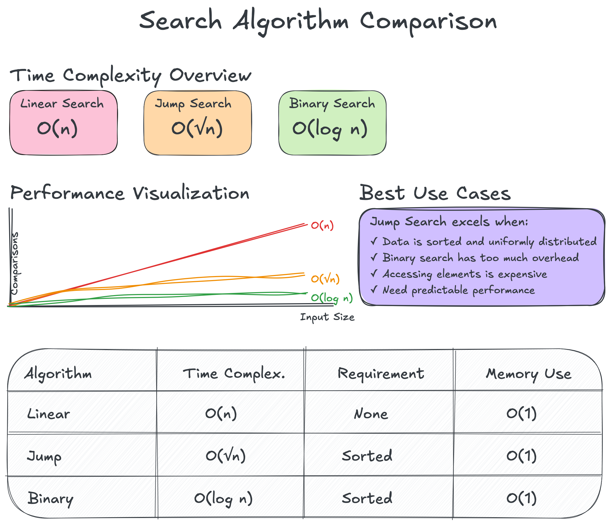

# Searching Algorithms

Fundamental algorithms for finding elements in data structures.

## Available Algorithms

### 1. [Linear Search](./linear-search/)

- Simplest search algorithm
- Works on unsorted data
- O(n) time complexity

### 2. [Binary Search](./binary-search/)

- Efficient search for sorted data
- O(log n) time complexity
- Requires random access

### 3. [Jump Search](./jump-search/)

- Optimization between linear and binary search
- O(√n) time complexity
- Good for external storage

### 4. [Interpolation Search](./interpolation-search/)

- Best for uniformly distributed numeric data
- O(log log n) average case
- Can degrade to O(n) for poor distributions

## Choosing the Right Algorithm

| Algorithm | Time | Space | Requirements | Best For |
|-----------|------|-------|--------------|----------|
| Linear | O(n) | O(1) | None | Small/unsorted data |
| Binary | O(log n) | O(1) | Sorted | General sorted data |
| Jump | O(√n) | O(1) | Sorted | External storage |
| Interpolation | O(log log n)* | O(1) | Sorted, numeric, uniform | Large numeric datasets |

*Average case for uniform distribution

## Performance Comparison

### Time Complexity Analysis

| Algorithm | Best Case | Average Case | Worst Case | Notes |
|-----------|-----------|--------------|------------|-------|
| Linear Search | O(1) | O(n) | O(n) | Target at first position / Target in middle / Target at end or not found |
| Binary Search | O(1) | O(log n) | O(log n) | Target at middle / Balanced partitions / Maximum comparisons |
| Jump Search | O(1) | O(√n) | O(√n) | Target at jump position / Typical case / Linear search in last block |
| Interpolation Search | O(1) | O(log log n) | O(n) | Perfect guess / Uniform distribution / Clustered data |

### Visual Performance Comparison

### Practical Performance Guidelines

#### For Different Array Sizes:
- **n < 100**: Linear search often fastest due to simplicity
- **100 < n < 10,000**: Binary search typically best for sorted data
- **n > 10,000**: Consider interpolation search for numeric data
- **External storage**: Jump search minimizes disk seeks

#### Memory Access Patterns:
- **Linear Search**: Sequential access, cache-friendly
- **Binary Search**: Random access, potential cache misses
- **Jump Search**: Hybrid - jumps then sequential
- **Interpolation Search**: Random access, distribution-dependent

### When to Use Each Algorithm

#### Linear Search Variants:
- **Basic Linear Search**: Finding first occurrence
- **Linear Search All**: Finding all occurrences
- **Reverse Linear Search**: Finding last occurrence
- **Predicate Search**: Custom search conditions

#### Binary Search Variants:
- **Basic Binary Search**: Standard implementation
- **Lower Bound**: First element ≥ target
- **Upper Bound**: First element > target
- **Equal Range**: All occurrences in sorted array

#### Jump Search Variants:
- **Standard Jump Search**: Using √n jump size
- **Custom Jump Size**: Optimized for specific data
- **Adaptive Jump**: Dynamic jump size adjustment

#### Interpolation Search Variants:
- **Standard Interpolation**: For uniform numeric data
- **Bounded Interpolation**: With fallback to binary search
- **Quadratic Interpolation**: For non-linear distributions

## Real-World Use Cases

### Linear Search Applications
1. **Contact Lists in Mobile Phones**
   - Small datasets (typically < 1000 contacts)
   - Need to search by various fields (name, number, email)
   - No sorting overhead for infrequent searches

2. **Shopping Cart Item Lookup**
   - Small number of items (usually < 50)
   - Need to find items by product ID
   - Frequent additions/removals make sorting impractical

3. **Process List in Task Manager**
   - Finding processes by name or PID
   - Dynamic list that changes frequently
   - Various search criteria (CPU usage, memory, name)

### Binary Search Applications
1. **Dictionary/Spell Checker**
   - Large sorted word lists (100K+ words)
   - Frequent lookups needed
   - Data rarely changes (can maintain sorted order)

2. **Database Indexes**
   - B-trees use binary search within nodes
   - Sorted indexes for quick record lookup
   - Range queries benefit from sorted data

3. **Version Control Systems**
   - Finding commits in sorted history
   - Binary search through commit timestamps
   - Git bisect for finding bug introduction

### Jump Search Applications
1. **File Systems on Slow Media**
   - Searching files on tape drives or optical media
   - Minimizes seek operations
   - Better than binary search for sequential access devices

2. **Large Database Tables**
   - When data is stored in blocks on disk
   - Reduces number of disk reads
   - Useful for columnar databases

3. **Network Packet Inspection**
   - Searching through packet buffers
   - Reduces memory access in high-speed networks
   - Good for hardware implementations

### Interpolation Search Applications
1. **Phone Directory Lookup**
   - Names distributed fairly uniformly (alphabetically)
   - Can guess approximate position
   - Much faster than binary search for large directories

2. **Timestamp-Based Log Search**
   - Logs with evenly distributed timestamps
   - Finding events in specific time ranges
   - O(log log n) performance for millions of entries

3. **Financial Trading Systems**
   - Searching orders by price in sorted order books
   - Prices often uniformly distributed in ranges
   - Microsecond improvements matter

### Hybrid Approaches in Practice
1. **Standard Library Implementations**
   - Python's bisect module uses binary search
   - Java's Arrays.binarySearch() includes optimizations
   - C++ STL uses introsort (hybrid of quicksort and heapsort)

2. **Database Query Optimizers**
   - Choose search strategy based on data statistics
   - May use interpolation for numeric columns
   - Falls back to binary search for strings

3. **Search Engines**
   - Inverted indexes with binary search
   - Jump search for disk-based indexes
   - Interpolation for numeric range queries

