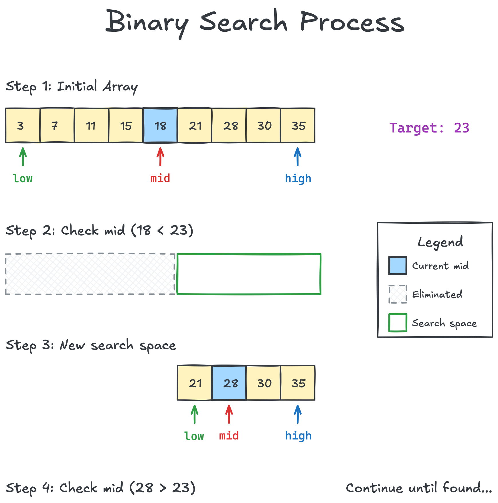
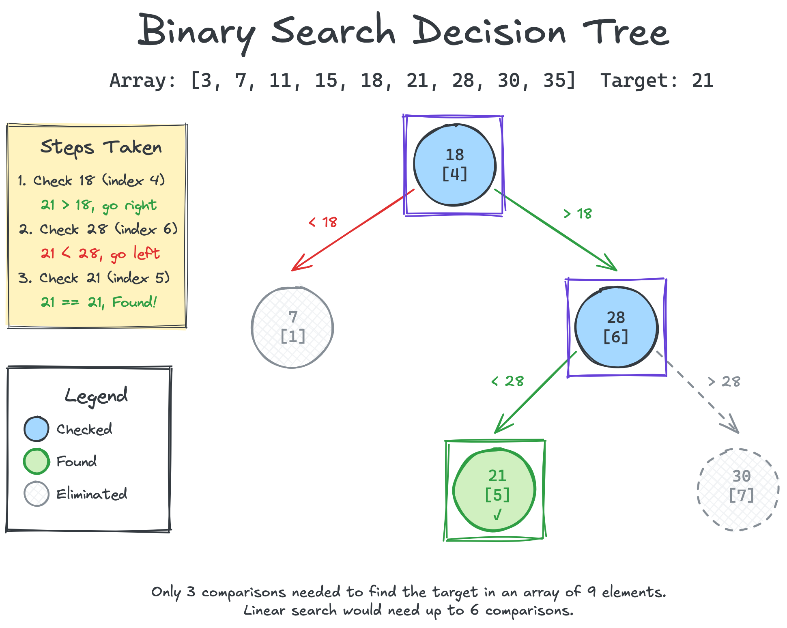
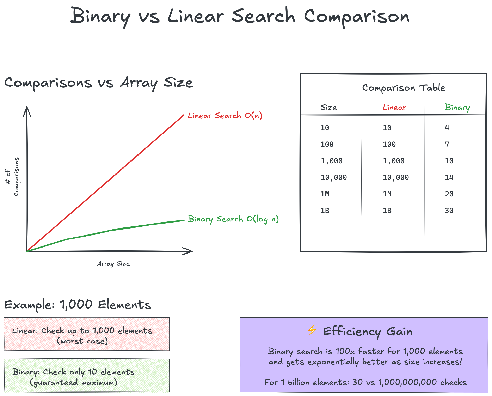

# Binary Search Visual Diagrams

This folder contains visual representations of the binary search algorithm.

## Available Diagrams

### 1. Binary Search Process

Shows step-by-step how binary search narrows down the search space by
repeatedly dividing it in half.

### 2. Binary Search Decision Tree

Illustrates the decision-making process as a tree, showing all possible
paths when searching for a specific element.

### 3. Complexity Comparison

Visual comparison between linear search and binary search, demonstrating
the dramatic performance difference as data size grows.

## How to Use These Diagrams

- **For Learning**: Study the process diagram to understand how the algorithm works
- **For Teaching**: Use the decision tree to explain the branching logic
- **For Motivation**: Show the complexity comparison to demonstrate why binary search matters

These diagrams complement the [theory documentation](../theory.md) and help
visualize concepts that can be difficult to grasp from text alone.