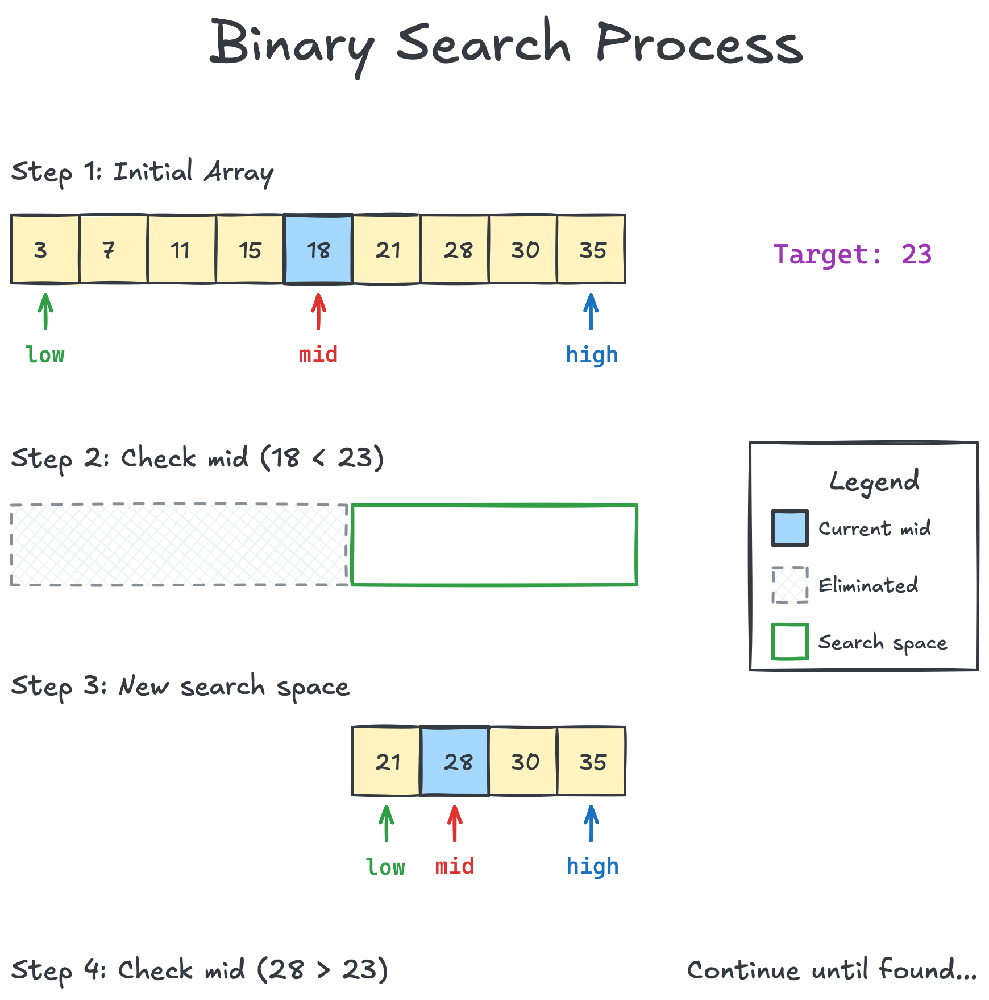
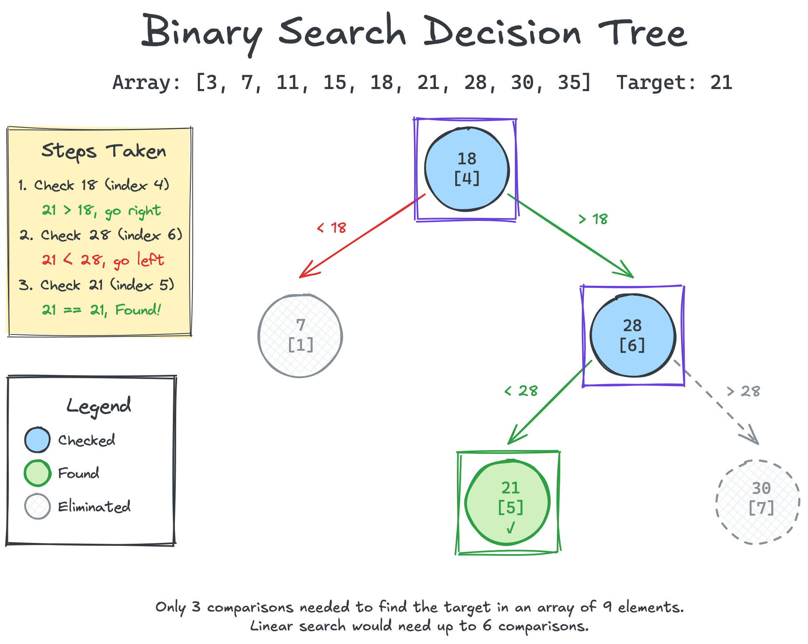
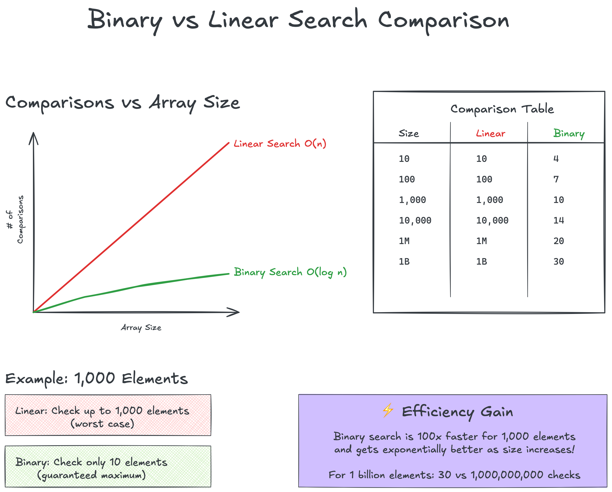

# Binary Search Theory

## Table of Contents

- [The Real-World Analogy](#the-real-world-analogy)
- [Understanding Binary Search](#understanding-binary-search)
- [Step-by-Step Example](#step-by-step-example)
- [The Algorithm](#the-algorithm)
- [Complexity Analysis](#complexity-analysis)
- [Common Variations](#common-variations)
- [Common Pitfalls](#common-pitfalls)
- [Key Takeaways](#key-takeaways)

## The Real-World Analogy

### Guessing a Number Game

You've probably played this game: "I'm thinking of a number between 1 and 1000."

**Linear Search Approach** (The tedious way):
"Is it 1?" No, higher.
"Is it 2?" No, higher.
"Is it 3?" No, higher.
...this could take up to 1000 guesses!

**Binary Search Approach** (The smart way):
"Is it 500?" No, higher.
"Is it 750?" No, lower.
"Is it 625?" No, higher.
"Is it 687?" No, higher.
"Is it 718?" No, lower.
"Is it 702?" No, higher.
"Is it 710?" Yes!

Only 7 guesses to find any number between 1 and 1000!

Note: This works because numbers 1-1000 are naturally sorted. The feedback
"higher" or "lower" only makes sense with ordered data!

### Physical Example: Finding a Specific Contact in Your Phone

Modern phones let you jump to any letter in your contacts. Looking for "Parker":

1. Jump to the middle of the alphabet (M) - too early
2. Jump between M and Z (around S) - too late
3. Jump between M and S (around P) - perfect section!
4. Now you only have a few names starting with P to check

This is much faster than scrolling through every contact from A to P!

### Classic Example: Finding a Page in a Book

You need to find page 823 in a 1000-page technical manual:

**Binary Search in Action**:

1. Open to the middle (page 500) - too early
2. Open halfway between 500 and 1000 (page 750) - too early
3. Open halfway between 750 and 1000 (page 875) - too late
4. Open between 750 and 875 (page 812) - too early
5. Open between 812 and 875 (page 843) - too late
6. Open between 812 and 843 (page 827) - too late
7. Open between 812 and 827 (page 819) - too early
8. Check the few pages between - found page 823!

This is exactly how we naturally search for pages - we don't flip through
one by one from the beginning!

## Understanding Binary Search

### Critical Requirement: Data MUST Be Sorted

Binary search only works on **sorted data**. This is absolutely essential
because the algorithm relies on knowing that:

- All elements to the left of any position are smaller (or equal)
- All elements to the right of any position are larger (or equal)

Without this property, binary search will give incorrect results!

### How It Works

Binary search maintains a "search space" - the portion of the array that
could contain our target. We repeatedly:

1. Check the middle element
2. If it's our target, we're done
3. If our target is smaller, search the left half
4. If our target is larger, search the right half

The key insight: with sorted data, we can eliminate half of the remaining
possibilities with each comparison. This is exactly what we do when looking
for a page in a book or a house on a street - we use the ordering to guide
our search!

### Visual Representation


*The binary search process: how we narrow down the search space*

```
Initial array: [2, 5, 8, 12, 16, 23, 38, 45, 56, 67, 78]
Target: 23

Step 1: Check middle (index 5, value 23)
        [2, 5, 8, 12, 16, |23|, 38, 45, 56, 67, 78]
         ↑              ↑   ↑    ↑               ↑
        low            mid      high
        Found! Return index 5
```

### The Invariant

The key to understanding binary search is the **invariant**: If the target
exists in the array, it must be within the range [low, high]. We maintain
this invariant throughout the algorithm.

## Step-by-Step Example

Let's find the number 18 in a sorted array:

```
Array: [3, 7, 11, 15, 18, 21, 28, 30, 35]
Index:  0  1   2   3   4   5   6   7   8

Step 1: low = 0, high = 8, mid = 4
        Check array[4] = 18
        18 == 18 ✓ Found at index 4!
```

Another example, finding 16 (not in array):

```
Array: [3, 7, 11, 15, 18, 21, 28, 30, 35]

Step 1: low = 0, high = 8, mid = 4
        array[4] = 18, and 16 < 18
        Search left: high = 3

Step 2: low = 0, high = 3, mid = 1
        array[1] = 7, and 16 > 7
        Search right: low = 2

Step 3: low = 2, high = 3, mid = 2
        array[2] = 11, and 16 > 11
        Search right: low = 3

Step 4: low = 3, high = 3, mid = 3
        array[3] = 15, and 16 > 15
        Search right: low = 4

Step 5: low = 4, high = 3
        low > high, element not found
```

### Decision Tree Visualization


*Binary search decision tree showing the path to find element 21*

## The Algorithm

### Iterative Implementation (Pseudocode)

```
function binarySearch(array, target):
    low = 0
    high = array.length - 1
    
    while low <= high:
        mid = low + (high - low) / 2  // Avoid overflow
        
        if array[mid] == target:
            return mid
        else if array[mid] < target:
            low = mid + 1
        else:
            high = mid - 1
    
    return -1  // Not found
```

### Why `mid = low + (high - low) / 2`?

The naive formula `mid = (low + high) / 2` can overflow when low and high
are large. The safer formula avoids this issue.

## Complexity Analysis

### Time Complexity: O(log n)

With each comparison, we eliminate half of the remaining elements:

- 1,000 elements → 10 comparisons max
- 1,000,000 elements → 20 comparisons max
- 1,000,000,000 elements → 30 comparisons max

This logarithmic growth is what makes binary search so powerful for large
datasets.

### Space Complexity

- **Iterative**: O(1) - Only uses a few variables
- **Recursive**: O(log n) - Due to the call stack

### Comparison with Linear Search

| Size | Linear Search (worst) | Binary Search (worst) |
|------|----------------------|----------------------|
| 10 | 10 comparisons | 4 comparisons |
| 100 | 100 comparisons | 7 comparisons |
| 1,000 | 1,000 comparisons | 10 comparisons |
| 1,000,000 | 1,000,000 comparisons | 20 comparisons |


*Visual comparison of linear vs binary search performance*

## Common Variations

### 1. Find First Occurrence

When duplicates exist, find the first occurrence:

```
Array: [1, 2, 2, 2, 3, 4, 5]
Target: 2
Result: index 1 (first 2)
```

### 2. Find Last Occurrence

Find the last occurrence of a duplicate:

```
Array: [1, 2, 2, 2, 3, 4, 5]
Target: 2
Result: index 3 (last 2)
```

### 3. Find Insertion Point

Where should we insert an element to maintain sorted order?

```
Array: [1, 3, 5, 7, 9]
Target: 6
Result: index 3 (between 5 and 7)
```

### 4. Search in Rotated Array

A sorted array that's been rotated:

```
Original: [1, 2, 3, 4, 5, 6, 7]
Rotated: [4, 5, 6, 7, 1, 2, 3]
```

## Common Pitfalls

### 1. Integer Overflow

```rust
// Bad - can overflow
let mid = (low + high) / 2;

// Good - prevents overflow
let mid = low + (high - low) / 2;
```

### 2. Infinite Loops

```rust
// Bad - infinite loop when low == high
while low < high {
    // If mid == low and we set low = mid, infinite loop!
}

// Good - terminates properly
while low <= high {
    // Always makes progress
}
```

### 3. Off-by-One Errors

```rust
// Bad - might miss the last element
let high = array.len() - 2;  // Wrong!

// Good - includes all elements
let high = array.len() - 1;
```

### 4. Forgetting Array Must Be Sorted

Binary search gives incorrect results on unsorted arrays. Always verify
or sort first!

```rust
// Example of WRONG usage - unsorted array
let arr = [3, 1, 4, 1, 5, 9, 2, 6];
let result = binary_search(&arr, &5); // May return None even though 5 exists!

// Correct approach
let mut arr = [3, 1, 4, 1, 5, 9, 2, 6];
arr.sort(); // Now: [1, 1, 2, 3, 4, 5, 6, 9]
let result = binary_search(&arr, &5); // Correctly returns Some(5)
```

### 5. Using with Floating Point

Comparing floating-point numbers directly can be problematic:

```rust
// Bad
if float_array[mid] == target {

// Better - use epsilon comparison
if (float_array[mid] - target).abs() < EPSILON {
```

## Key Takeaways

1. **Binary search requires sorted data** - This is non-negotiable
2. **O(log n) is incredibly fast** - Even billions of elements need ~30 checks
3. **Watch for integer overflow** - Use the safe mid-point formula
4. **Many variations exist** - First/last occurrence, insertion point, etc.
5. **Perfect for arrays** - Random access makes it efficient
6. **Not suitable for linked lists** - No efficient random access

## Practice Problems

1. Implement basic binary search
2. Find the first occurrence of a duplicate
3. Find the insertion point for a new element
4. Search in a rotated sorted array
5. Find the peak element in a mountain array

## Next Steps

- [See the implementation](../../../structures/01-arrays/implementations/rust/src/algorithms/binary_search.rs)
- [Try the exercises](../../../structures/01-arrays/exercises/rust/src/binary_search_exercise.rs)
