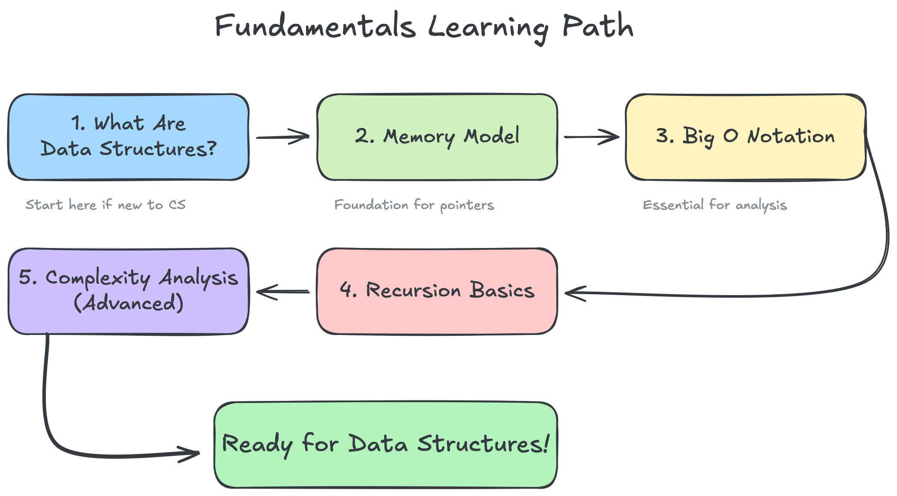

# Computer Science Fundamentals

## Table of Contents

- [Overview](#overview)
- [Topics Covered](#topics-covered)
  - [What Are Data Structures?](#1-what-are-data-structures)
  - [Memory Model](#2-memory-model)
  - [Big O Notation](#3-big-o-notation)
  - [Recursion Basics](#4-recursion-basics)
  - [Complexity Analysis - Advanced](#5-complexity-analysis---advanced-topics)
- [Learning Path](#learning-path)
- [Prerequisites](#prerequisites)
- [Key Skills You'll Develop](#key-skills-youll-develop)
- [Visual Learning](#visual-learning)
- [Practice Recommendations](#practice-recommendations)
- [Next Steps](#next-steps)

## Overview

Essential concepts you need before diving into data structures.

This section covers the building blocks you'll need to understand data
structures and algorithms. We'll reference these concepts throughout
the course, so spend some time getting comfortable with them.

## Topics Covered

### 1. [What Are Data Structures?](what-are-data-structures.md)

- Introduction to data organization
- Why data structures matter
- Abstract Data Types (ADTs) vs concrete implementations
- Choosing the right data structure

### 2. [Memory Model](memory-model.md)

- Understanding stack vs heap memory
- Memory allocation and management
- Pointers and references
- Memory efficiency considerations

### 3. [Big O Notation](big-o-notation.md)

- Time complexity analysis
- Space complexity analysis
- Best, average, and worst-case scenarios
- Common complexity classes (O(1), O(n), O(n²), etc.)
- Practical examples and comparisons

### 4. [Recursion Basics](recursion-basics.md)

- Understanding recursive thinking
- Base cases and recursive cases
- Call stack and stack frames
- Tail recursion optimization
- When to use recursion vs iteration
- Common recursive patterns

### 5. [Complexity Analysis - Advanced Topics](complexity-analysis.md)

- Master Theorem for divide-and-conquer algorithms
- Recurrence relations
- Amortized analysis
- Probabilistic analysis
- Cache effects and real-world performance
- Parallel algorithm complexity

## Learning Path

1. **Start with "What Are Data Structures?"** if you're new to
the concept
2. **Understand the Memory Model** to see how data is stored
3. **Master Big O Notation** for analyzing algorithm efficiency
4. **Learn Recursion Basics** since many algorithms use recursion
5. **Dive into Advanced Complexity Analysis** once you're comfortable
with the basics

## Prerequisites

- Basic programming knowledge (variables, functions, control flow)
- Simple mathematics (algebra, basic logarithms)
- Familiarity with at least one programming language

## Key Skills You'll Develop

- **Analytical Thinking**: Break down problems systematically
- **Performance Analysis**: Evaluate and compare algorithm efficiency
- **Memory Awareness**: Understand the cost of data storage and access
- **Recursive Problem Solving**: Think in terms of smaller subproblems
- **Optimization Mindset**: Choose appropriate trade-offs between time
and space

## Visual Learning

Each topic includes diagrams to help visualize abstract concepts:

- Memory layout visualizations
- Big O growth comparisons
- Recursion call stack animations
- Algorithm complexity graphs

## Practice Recommendations

1. **Code Along**: Implement examples in your preferred language
2. **Analyze Daily**: Practice identifying time/space complexity in code
you write
3. **Debug Recursion**: Use the debugging techniques to understand
recursive flows
4. **Benchmark Code**: Measure actual performance to validate
theoretical analysis

## Next Steps

After completing these fundamentals, you'll be ready to explore:

- [Arrays and Dynamic Arrays](../01-arrays/README.md)
- Linked Lists
- Trees and Graphs
- Hash Tables
- Advanced algorithms

Remember: These fundamentals are the foundation of computer science. Take
time to understand them deeply - they'll serve you throughout your
programming career!
