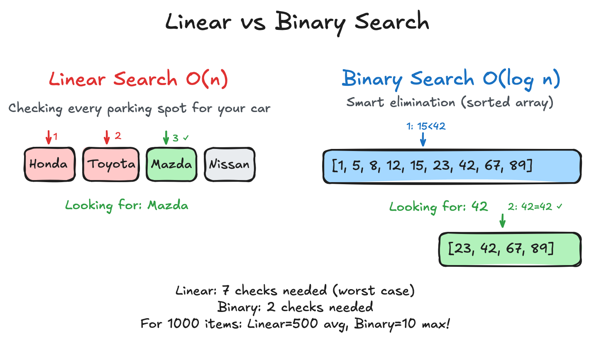
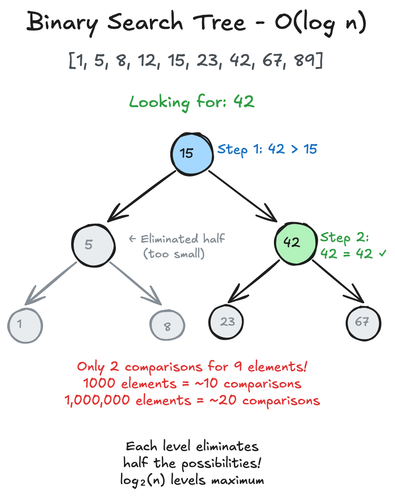

# Big O Notation

## Table of Contents

- [Introduction](#introduction)
- [What is Big O?](#what-is-big-o)
- [Time Complexity](#time-complexity)
  - [Constant Time - O(1)](#constant-time---o1)
  - [Linear Time - O(n)](#linear-time---on)
  - [Quadratic Time - O(n²)](#quadratic-time---on²)
  - [Logarithmic Time - O(log n)](#logarithmic-time---olog-n)
  - [Linearithmic Time - O(n log n)](#linearithmic-time---on-log-n)
  - [Exponential Time - O(2ⁿ)](#exponential-time---o2ⁿ)
  - [Factorial Time - O(n!)](#factorial-time---on)
- [Space Complexity](#space-complexity)
- [Best, Average, and Worst Case](#best-average-and-worst-case)
- [Common Patterns](#common-patterns)
- [Practical Examples](#practical-examples)
- [Analyzing Complexity - Example](#analyzing-complexity---example)
- [Complexity Quick Reference](#complexity-quick-reference)
  - [Understanding Amortized Complexity](#understanding-amortized-complexity)
- [Key Takeaways](#key-takeaways)
- [Common Complexity Analysis Mistakes](#common-complexity-analysis-mistakes)

## Introduction

Imagine you're planning a road trip from Tokyo to Osaka. You could take the
Shinkansen (bullet train), drive a car, ride a bicycle, or even walk. Each
option takes a different amount of time - and that time difference becomes more
dramatic as the distance increases. Big O notation is how we describe these
kinds of differences in algorithms.

## What is Big O?

Big O notation describes how an algorithm's performance changes as the input
size grows. It's like describing how a vehicle's travel time increases with
distance:

- **Walking**: Time increases directly with distance
- **Driving**: Time increases, but less than walking
- **Flying**: Most time is spent at airports (constant), not traveling


In programming terms:

```rust
// Different algorithms for finding a person in a phonebook

// Linear search (like reading every page)
// Time: O(n), Space: O(1)
fn find_person_linear(phonebook: &[&str], name: &str) -> Option<usize> {
    for (index, entry) in phonebook.iter().enumerate() {
        if entry == &name {
            return Some(index);
        }
    }
    None
}

// Binary search (like opening to the middle and choosing a direction)
// Time: O(log n), Space: O(1)
// Precondition: phonebook must be sorted
fn find_person_binary(phonebook: &[&str], name: &str) -> Option<usize> {
    let mut left = 0;
    let mut right = phonebook.len();
    
    while left < right {
        let mid = left + (right - left) / 2;
        match phonebook[mid].cmp(name) {
            std::cmp::Ordering::Equal => return Some(mid),
            std::cmp::Ordering::Less => left = mid + 1,
            std::cmp::Ordering::Greater => right = mid,
        }
    }
    None
}
```



## Time Complexity

### Constant Time - O(1)

Operations that take the same time regardless of input size. Like using a
teleporter - distance doesn't matter!

```rust
// Accessing an array element by index
// Time: O(1), Space: O(1)
fn get_first_car(cars: &[&str]) -> Option<&str> {
    cars.first().copied()  // Always takes same time
}

// HashMap lookup
// Time: O(1) average, O(n) worst case
// Space: O(1) for lookup operation
use std::collections::HashMap;
fn get_price(prices: &HashMap<&str, u32>, item: &str) -> Option<&u32> {
    prices.get(item)  // Hash calculation + one lookup
}
```

**Real-world analogy**: Opening a book to a bookmarked page - doesn't matter
if the book has 100 or 1000 pages.

### Linear Time - O(n)

Time grows proportionally with input size. Like checking every car in a
parking lot to find yours.

```rust
// Finding maximum value in unsorted array
// Time: O(n), Space: O(1)
fn find_max(numbers: &[i32]) -> Option<i32> {
    let mut max = None;
    for &num in numbers {
        max = Some(max.map_or(num, |m| m.max(num)));
    }
    max
}

// Calculating sum of all elements
// Time: O(n), Space: O(1)
fn sum_all(numbers: &[i32]) -> i32 {
    numbers.iter().sum()  // Must visit every element
}
```

**Real-world analogy**: Reading a book page by page - twice as many pages
means twice as much time.

### Quadratic Time - O(n²)

Time grows with the square of input size. Often seen in nested loops.

```rust
// Checking for duplicates (naive approach)
// Time: O(n²), Space: O(1)
fn has_duplicates(items: &[i32]) -> bool {
    for i in 0..items.len() {
        for j in i + 1..items.len() {
            if items[i] == items[j] {
                return true;
            }
        }
    }
    false
}

// Bubble sort
// Time: O(n²), Space: O(1) - sorts in place
fn bubble_sort(numbers: &mut [i32]) {
    let len = numbers.len();
    for i in 0..len {
        for j in 0..len - i - 1 {
            if numbers[j] > numbers[j + 1] {
                numbers.swap(j, j + 1);
            }
        }
    }
}
```

**Real-world analogy**: Comparing every student with every other student
in a class for a group project - class size of 30 means 435 comparisons!


### Logarithmic Time - O(log n)

Time grows slowly as input increases. Doubling the input adds only one more
step.

```rust
// Binary search in sorted array
// Time: O(log n), Space: O(1)
fn binary_search(sorted: &[i32], target: i32) -> Option<usize> {
    let mut left = 0;
    let mut right = sorted.len();
    
    while left < right {
        let mid = left + (right - left) / 2;
        match sorted[mid].cmp(&target) {
            std::cmp::Ordering::Equal => return Some(mid),
            std::cmp::Ordering::Less => left = mid + 1,
            std::cmp::Ordering::Greater => right = mid,
        }
    }
    None
}

// Finding height of balanced binary tree
// Time: O(1), Space: O(1)
fn tree_height(size: usize) -> u32 {
    (size as f64).log2().ceil() as u32
}
```

**Real-world analogy**: Finding a word in a dictionary by opening to the
middle, then the middle of the remaining half, and so on.



### Linearithmic Time - O(n log n)

Combines linear and logarithmic growth. Common in efficient sorting algorithms.

```rust
// Merge sort
// Time: O(n log n), Space: O(n) - needs temporary arrays
fn merge_sort(numbers: &mut [i32]) {
    let len = numbers.len();
    if len <= 1 {
        return;
    }
    
    let mid = len / 2;
    merge_sort(&mut numbers[..mid]);
    merge_sort(&mut numbers[mid..]);
    
    // Merge the sorted halves
    let mut temp = numbers.to_vec();
    merge(&numbers[..mid], &numbers[mid..], &mut temp);
    numbers.copy_from_slice(&temp);
}

fn merge(left: &[i32], right: &[i32], output: &mut [i32]) {
    let mut i = 0;
    let mut j = 0;
    let mut k = 0;
    
    while i < left.len() && j < right.len() {
        if left[i] <= right[j] {
            output[k] = left[i];
            i += 1;
        } else {
            output[k] = right[j];
            j += 1;
        }
        k += 1;
    }
    
    while i < left.len() {
        output[k] = left[i];
        i += 1;
        k += 1;
    }
    
    while j < right.len() {
        output[k] = right[j];
        j += 1;
        k += 1;
    }
}
```

### Exponential Time - O(2ⁿ)

Time doubles with each additional input. Common in recursive algorithms
without optimization.

```rust
// Fibonacci without memoization
// Time: O(2ⁿ), Space: O(n) - call stack
fn fibonacci_naive(n: u32) -> u64 {
    if n <= 1 {
        return n as u64;
    }
    fibonacci_naive(n - 1) + fibonacci_naive(n - 2)
}

// Subset generation
// Time: O(2ⁿ), Space: O(n × 2ⁿ) - storing all subsets
fn all_subsets<T: Clone>(items: &[T]) -> Vec<Vec<T>> {
    let n = items.len();
    let mut subsets = Vec::new();
    
    // Generate all 2ⁿ possible subsets
    for i in 0..(1 << n) {
        let mut subset = Vec::new();
        for j in 0..n {
            if i & (1 << j) != 0 {
                subset.push(items[j].clone());
            }
        }
        subsets.push(subset);
    }
    subsets
}
```

**Real-world analogy**: Virus spreading where each person infects 2 others

- Day 1: 1 person
- Day 10: 1,024 people
- Day 20: 1,048,576 people
- Day 30: 1,073,741,824 people!

### Factorial Time - O(n!)

The worst complexity - time grows factorially. Common in brute-force solutions
that check all permutations.

```rust
// Generate all permutations of items
// Time: O(n!), Space: O(n!) - storing all permutations
fn permutations(items: Vec<i32>) -> Vec<Vec<i32>> {
    if items.len() <= 1 {
        return vec![items];
    }
    
    let mut result = Vec::new();
    for i in 0..items.len() {
        let mut remaining = items.clone();
        let current = remaining.remove(i);
        
        for mut perm in permutations(remaining) {
            perm.insert(0, current);
            result.push(perm);
        }
    }
    result
}

// Traveling salesman brute force
// Time: O(n!), Space: O(n)
fn find_shortest_delivery_route(locations: &[(f64, f64)]) -> f64 {
    // Check all possible routes for delivery truck
    let indices: Vec<usize> = (0..locations.len()).collect();
    let all_routes = permutations(indices);
    let mut shortest = f64::INFINITY;
    
    for route in all_routes {
        let mut distance = 0.0;
        for i in 0..route.len() - 1 {
            let (x1, y1) = locations[route[i]];
            let (x2, y2) = locations[route[i + 1]];
            distance += ((x2 - x1).powi(2) + (y2 - y1).powi(2)).sqrt();
        }
        shortest = shortest.min(distance);
    }
    shortest
}
```

**Real-world analogy**: Trying all possible seating arrangements at a wedding

- 5 guests = 120 arrangements
- 10 guests = 3,628,800 arrangements
- 20 guests = 2,432,902,008,176,640,000 arrangements!

## Space Complexity

Big O also describes memory usage. Think of it as how many parking spaces
you need.


```rust
// O(1) space - uses fixed amount regardless of input
fn swap_first_last(items: &mut [i32]) {
    if items.len() >= 2 {
        let len = items.len();
        items.swap(0, len - 1);
    }
}

// O(n) space - creates new array proportional to input
fn double_all(numbers: &[i32]) -> Vec<i32> {
    numbers.iter().map(|&n| n * 2).collect()
}

// O(n²) space - creates 2D matrix
fn create_multiplication_table(n: usize) -> Vec<Vec<i32>> {
    let mut table = vec![vec![0; n]; n];
    for i in 0..n {
        for j in 0..n {
            table[i][j] = (i * j) as i32;
        }
    }
    table
}
```

## Best, Average, and Worst Case

Algorithms can perform differently depending on the input:

```rust
// Quick sort example
fn quick_sort(numbers: &mut [i32]) {
    if numbers.len() <= 1 {
        return;
    }
    
    let pivot_index = partition(numbers);
    let (left, right) = numbers.split_at_mut(pivot_index);
    quick_sort(left);
    quick_sort(&mut right[1..]);
}

fn partition(numbers: &mut [i32]) -> usize {
    let len = numbers.len();
    let pivot = numbers[len - 1];
    let mut i = 0;
    
    for j in 0..len - 1 {
        if numbers[j] < pivot {
            numbers.swap(i, j);
            i += 1;
        }
    }
    numbers.swap(i, len - 1);
    i
}

// Best case: O(n log n) - well-balanced partitions
// Average case: O(n log n) - reasonably balanced
// Worst case: O(n²) - already sorted array
```


## Common Patterns

Recognizing these patterns helps predict complexity:

```rust
// Single loop: O(n)
for item in collection {
    // process item
}

// Nested loops: O(n²)
for i in 0..n {
    for j in 0..n {
        // process pair
    }
}

// Divide and conquer: O(log n) or O(n log n)
fn divide_conquer(data: &[i32]) {
    if data.len() <= 1 {
        return;
    }
    let mid = data.len() / 2;
    divide_conquer(&data[..mid]);
    divide_conquer(&data[mid..]);
}

// Multiple sequential loops: Still O(n)
for item in collection {
    // first pass
}
for item in collection {
    // second pass
}
// Total: O(n) + O(n) = O(2n) = O(n)
```

## Practical Examples

Let's analyze some real-world scenarios:

```rust
use std::collections::{HashMap, HashSet};

// Finding common elements between two arrays
// Naive approach - Time: O(n²), Space: O(k) where k is number of common elements
fn common_elements_naive(arr1: &[i32], arr2: &[i32]) -> Vec<i32> {
    let mut common = Vec::new();
    for &item1 in arr1 {
        for &item2 in arr2 {
            if item1 == item2 && !common.contains(&item1) {
                common.push(item1);
            }
        }
    }
    common
}

// Optimized approach - Time: O(n + m), Space: O(n + m)
fn common_elements_optimized(arr1: &[i32], arr2: &[i32]) -> Vec<i32> {
    let set1: HashSet<_> = arr1.iter().copied().collect();
    let set2: HashSet<_> = arr2.iter().copied().collect();
    set1.intersection(&set2).copied().collect()
}

// Checking if string has all unique characters
// Using HashMap: O(n) time, O(n) space
fn has_unique_chars(s: &str) -> bool {
    let mut seen = HashSet::new();
    for ch in s.chars() {
        if !seen.insert(ch) {
            return false;
        }
    }
    true
}

// Finding two numbers that sum to target
// Optimal solution: O(n) time, O(n) space
fn two_sum(numbers: &[i32], target: i32) -> Option<(usize, usize)> {
    let mut seen = HashMap::new();
    for (i, &num) in numbers.iter().enumerate() {
        let complement = target - num;
        if let Some(&j) = seen.get(&complement) {
            return Some((j, i));
        }
        seen.insert(num, i);
    }
    None
}
```

## Analyzing Complexity - Example

Let's analyze a real function step by step:

```rust
fn find_duplicates_and_sort(numbers: &[i32]) -> Vec<i32> {
    let mut result = Vec::new();
    
    // Step 1: Find duplicates - O(n²) time
    for i in 0..numbers.len() {
        for j in i + 1..numbers.len() {
            if numbers[i] == numbers[j] && !result.contains(&numbers[i]) {
                result.push(numbers[i]);
            }
        }
    }
    
    // Step 2: Sort the duplicates - O(k log k) where k = result.len()
    result.sort();
    
    result
}

// Analysis:
// Time Complexity: O(n²) + O(k log k) = O(n²) (dominant term)
// Space Complexity: O(k) where k ≤ n/2 = O(n)
// 
// Can we do better? Yes!
fn find_duplicates_optimized(numbers: &[i32]) -> Vec<i32> {
    use std::collections::HashMap;
    let mut counts = HashMap::new();
    
    // Count occurrences - O(n) time
    for &num in numbers {
        *counts.entry(num).or_insert(0) += 1;
    }
    
    // Collect duplicates - O(n) time
    let mut result: Vec<i32> = counts
        .into_iter()
        .filter(|&(_, count)| count > 1)
        .map(|(num, _)| num)
        .collect();
    
    // Sort - O(k log k)
    result.sort();
    
    result
}

// Optimized Analysis:
// Time Complexity: O(n) + O(n) + O(k log k) = O(n + k log k)
// Space Complexity: O(n) for HashMap
// Much better for large arrays!
```

## Complexity Quick Reference

| Algorithm | Best Time | Average Time | Worst Time | Space |
|-----------|-----------|--------------|------------|-------|
| Linear Search | O(1) | O(n) | O(n) | O(1) |
| Binary Search | O(1) | O(log n) | O(log n) | O(1) |
| Bubble Sort | O(n) | O(n²) | O(n²) | O(1) |
| Quick Sort | O(n log n) | O(n log n) | O(n²) | O(log n) |
| Merge Sort | O(n log n) | O(n log n) | O(n log n) | O(n) |
| Heap Sort | O(n log n) | O(n log n) | O(n log n) | O(1) |
| Hash Table Insert/Search | O(1) | O(1) | O(n) | O(n) |
| Binary Tree Search | O(log n) | O(log n) | O(n) | O(1) |
| BFS/DFS | O(V+E) | O(V+E) | O(V+E) | O(V) |

### Quick Examples

```rust
// Linear Search - Best: O(1) first element, Worst: O(n) last/not found
fn linear_search<T: PartialEq>(arr: &[T], target: &T) -> Option<usize> {
    for (i, item) in arr.iter().enumerate() {
        if item == target { return Some(i); }
    }
    None
}

// Binary Search - Best: O(1) middle element, Worst: O(log n)
fn binary_search(arr: &[i32], target: i32) -> Option<usize> {
    let (mut left, mut right) = (0, arr.len());
    while left < right {
        let mid = left + (right - left) / 2;
        match arr[mid].cmp(&target) {
            std::cmp::Ordering::Equal => return Some(mid),
            std::cmp::Ordering::Less => left = mid + 1,
            std::cmp::Ordering::Greater => right = mid,
        }
    }
    None
}

// Bubble Sort - Best: O(n) already sorted, Worst: O(n²)
fn bubble_sort<T: Ord>(arr: &mut [T]) {
    let n = arr.len();
    for i in 0..n {
        let mut swapped = false;
        for j in 0..n - i - 1 {
            if arr[j] > arr[j + 1] {
                arr.swap(j, j + 1);
                swapped = true;
            }
        }
        if !swapped { break; } // Best case optimization
    }
}

// BFS Graph Traversal - Always O(V+E)
use std::collections::{VecDeque, HashSet};
fn bfs(graph: &[Vec<usize>], start: usize) -> Vec<usize> {
    let mut visited = HashSet::new();
    let mut queue = VecDeque::new();
    let mut result = Vec::new();
    
    queue.push_back(start);
    visited.insert(start);
    
    while let Some(node) = queue.pop_front() {
        result.push(node);
        for &neighbor in &graph[node] {
            if visited.insert(neighbor) {
                queue.push_back(neighbor);
            }
        }
    }
    result
}
```

**Common Data Structure Operations:**

| Structure | Access | Search | Insert | Delete | Space |
|-----------|--------|--------|--------|--------|-------|
| Array | O(1) | O(n) | O(n) | O(n) | O(n) |
| Dynamic Array (Vec) | O(1) | O(n) | O(1)* | O(n) | O(n) |
| Linked List | O(n) | O(n) | O(1) | O(1) | O(n) |
| Stack | O(n) | O(n) | O(1) | O(1) | O(n) |
| Queue | O(n) | O(n) | O(1) | O(1) | O(n) |
| HashMap | N/A | O(1)* | O(1)* | O(1)* | O(n) |
| Binary Search Tree | O(log n)* | O(log n)* | O(log n)* | O(log n)* | O(n) |
| B-Tree | O(log n) | O(log n) | O(log n) | O(log n) | O(n) |

*Amortized time complexity

### Understanding Amortized Complexity

Amortized complexity is the average time per operation over a sequence of
operations, even if individual operations might be expensive.

```rust
// Vec (dynamic array) example
// push() is O(1) amortized, but occasionally O(n)
fn demonstrate_vec_growth() {
    let mut numbers = Vec::new();
    
    // Most pushes are O(1) - just add to end
    for i in 0..100 {
        numbers.push(i); // Usually fast
        
        // When capacity is exceeded, Vec doubles in size
        // This resize is O(n) but happens rarely
        if numbers.len() == numbers.capacity() {
            println!("Resizing at {}: capacity {} -> {}", 
                     i, numbers.capacity(), numbers.capacity() * 2);
        }
    }
}

// HashMap also has amortized O(1) insert
// Occasionally rehashes entire table when load factor exceeded
```

**Real-world analogy**: Like refueling your car

- Most trips: O(1) - just drive
- Every ~500km: O(n) - stop to refuel
- Average over many trips: Still O(1) per kilometer


## Key Takeaways

1. **Big O describes growth rate**, not exact time
   - O(n) with 1ms per operation is faster than O(1) with 1 second per
     operation for small inputs

2. **Drop constants and smaller terms**
   - O(2n) → O(n)
   - O(n² + n) → O(n²)

3. **Consider both time and space**
   - Sometimes trading memory for speed is worth it

4. **Real-world performance matters**
   - Cache-friendly O(n) can beat cache-unfriendly O(log n)

5. **Choose the right tool for the job**
   - Small dataset? Simple O(n²) might be fine
   - Massive dataset? You need O(n) or O(log n)


## Common Complexity Analysis Mistakes

Avoid these pitfalls when analyzing algorithm complexity:

```rust
// Mistake 1: Hidden loops in methods
fn find_unique_items(items: &[i32]) -> Vec<i32> {
    let mut unique = Vec::new();
    for &item in items {
        // contains() is O(n), making this O(n²) not O(n)!
        if !unique.contains(&item) {
            unique.push(item);
        }
    }
    unique
}

// Better: Use HashSet for O(n) total
use std::collections::HashSet;
fn find_unique_items_better(items: &[i32]) -> Vec<i32> {
    let set: HashSet<_> = items.iter().copied().collect();
    set.into_iter().collect()
}

// Mistake 2: String concatenation in loops
fn build_string_naive(words: &[&str]) -> String {
    let mut result = String::new();
    for word in words {
        // Each += creates new string, O(n²) total!
        result += word;
        result += " ";
    }
    result
}

// Better: Use String::with_capacity or join()
fn build_string_better(words: &[&str]) -> String {
    words.join(" ")  // O(n)
}

// Mistake 3: Not considering input characteristics
fn process_data(data: &[i32]) {
    // Assuming data is sorted when it might not be
    let result = binary_search(data, 42); // Wrong if unsorted!
}
```

Remember: Big O is about scalability. It helps you choose algorithms that will
still work when your user base grows from 100 to 1 million!
