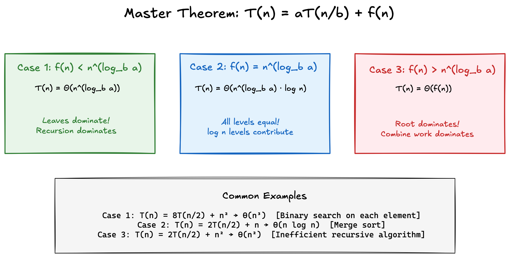
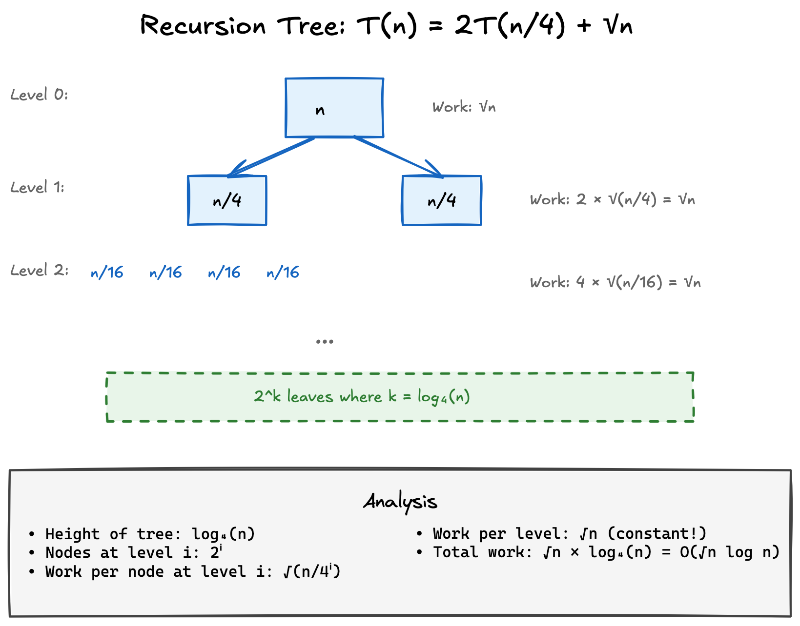
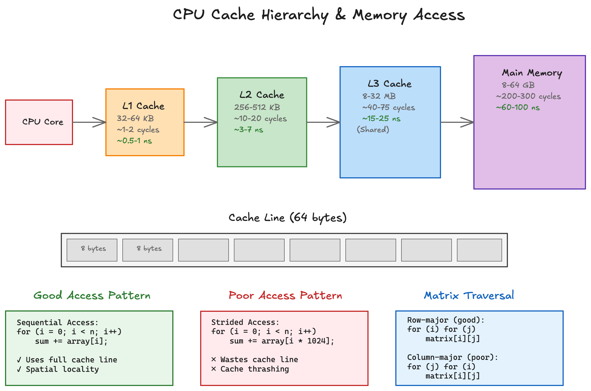
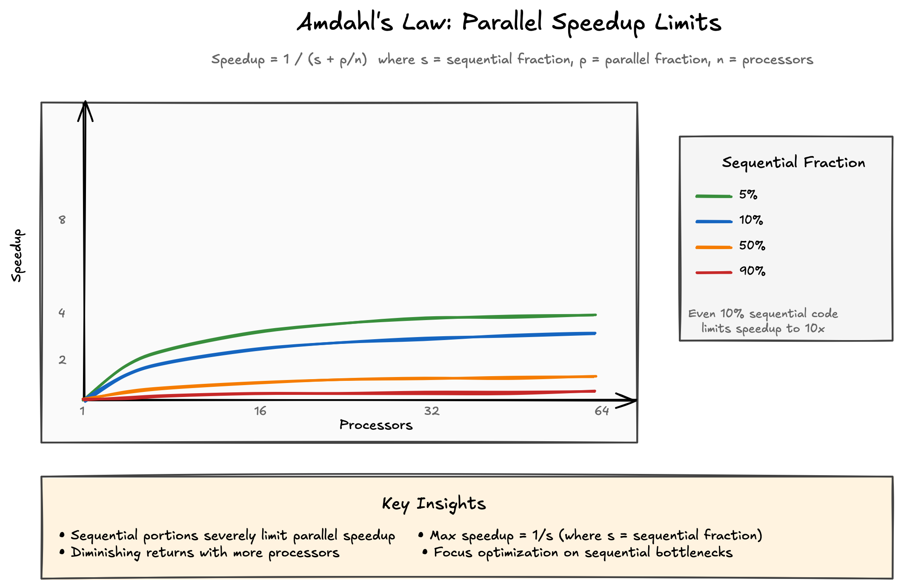

# Complexity Analysis - Advanced Topics

## Table of Contents

- [Introduction](#introduction)
  - [Understanding Recurrence Notation](#understanding-recurrence-notation)
- [Master Theorem](#master-theorem)
  - [Understanding the Cases](#understanding-the-cases)
  - [Practical Applications](#practical-applications)
- [Recurrence Relations](#recurrence-relations)
  - [Substitution Method](#substitution-method)
  - [Recursion Tree Method](#recursion-tree-method)
  - [Common Patterns](#common-patterns)
- [Advanced Data Structure Analysis](#advanced-data-structure-analysis)
  - [Self-Balancing Trees](#self-balancing-trees)
  - [Disjoint Set Operations](#disjoint-set-operations)
  - [Persistent Data Structures](#persistent-data-structures)
- [Algorithm Design Paradigms](#algorithm-design-paradigms)
  - [Greedy Algorithm Complexity](#greedy-algorithm-complexity)
  - [Dynamic Programming Analysis](#dynamic-programming-analysis)
  - [Backtracking Complexity](#backtracking-complexity)
- [Real-World Case Studies](#real-world-case-studies)
  - [Database Query Optimization](#database-query-optimization)
  - [Network Routing](#network-routing)
  - [Cache-Aware Algorithms](#cache-aware-algorithms)
- [Probabilistic Analysis](#probabilistic-analysis)
  - [Expected Complexity](#expected-complexity)
  - [Randomized Algorithms](#randomized-algorithms)
- [Parallel Algorithm Complexity](#parallel-algorithm-complexity)
  - [Work and Span](#work-and-span)
  - [Amdahl's Law](#amdahls-law)
- [Memory Hierarchy Effects](#memory-hierarchy-effects)
  - [Cache Complexity](#cache-complexity)
  - [I/O Complexity](#io-complexity)
- [Common Pitfalls in Complexity Analysis](#common-pitfalls-in-complexity-analysis)
- [Key Takeaways](#key-takeaways)
- [Related Topics](#related-topics)

## Introduction

**Note**: This document covers advanced complexity analysis topics. If
you're new to Big O notation, we recommend starting with the
[Big O Notation](big-o-notation.md) guide first, then returning here after
you've worked through other fundamental topics.

You've learned Big O notation - now let's tackle the advanced techniques
that professional engineers use to analyze complex systems. Think of this
as moving from basic arithmetic to engineering calculations.

### Understanding Recurrence Notation

Before diving in, let's clarify the notation we'll use. When we write:

```
T(n) = 8T(n/2) + O(n²)
```

This is a **recurrence relation** that describes how an algorithm's runtime
grows:

- **T(n)** represents the time (or work) required for input size n
- **T(n/2)** means the time for a subproblem of half the size
- **8T(n/2)** means we have 8 such subproblems
- **O(n²)** is the additional work done at this level

Think of it as a recipe: "To solve a problem of size n, we split it into
8 problems of size n/2, solve each recursively, then do n² work to combine
the results."

## Master Theorem

The Master Theorem is like having a formula sheet for divide-and-conquer
algorithms. Just as structural engineers have standard formulas for beam
loads, we have standard formulas for recursive complexity.



### Understanding the Cases

For recurrences of the form: T(n) = aT(n/b) + f(n)

```rust
// Case 1: Work decreases geometrically down the tree
// T(n) = 8T(n/2) + O(n²)
// Here a = 8, b = 2, log_b(a) = 3
// Since n² < n³, we get T(n) = O(n³)
fn case1_example(data: &mut [i32]) {
    if data.len() <= 1 {
        return;
    }
    
    // Do O(n²) work at this level
    let n = data.len();
    for i in 0..n {
        for j in 0..n {
            // Some O(1) operation
        }
    }
    
    // Split into 8 subproblems of size n/2
    let mid = data.len() / 2;
    let (left, right) = data.split_at_mut(mid);
    
    // Recursively process (in reality, would split into 8 parts)
    case1_example(left);
    case1_example(right);
    // ... 6 more recursive calls
}

// Case 2: Work is same at each level
// T(n) = 2T(n/2) + O(n)
// Here a = 2, b = 2, log_b(a) = 1
// Since f(n) = n¹, we get T(n) = O(n log n)
fn merge_sort<T: Ord + Clone>(data: &mut [T]) {
    if data.len() <= 1 {
        return;
    }
    
    let mid = data.len() / 2;
    let mut left = data[..mid].to_vec();
    let mut right = data[mid..].to_vec();
    
    merge_sort(&mut left);
    merge_sort(&mut right);
    
    // O(n) merge operation
    merge(&left, &right, data);
}

// Helper function for merge sort (implementation detail)
fn merge<T: Ord + Clone>(left: &[T], right: &[T], output: &mut [T]) {
    // See full implementation in merge sort section below
}

// Case 3: Work increases geometrically down the tree
// T(n) = 2T(n/2) + O(n²)
// Here a = 2, b = 2, log_b(a) = 1
// Since n² > n¹, we get T(n) = O(n²)
fn case3_example(data: &[i32]) -> i32 {
    if data.len() <= 1 {
        return data.get(0).copied().unwrap_or(0);
    }
    
    // Do O(n²) work - check all pairs
    let mut sum = 0;
    for i in 0..data.len() {
        for j in 0..data.len() {
            sum += data[i] * data[j];
        }
    }
    
    let mid = data.len() / 2;
    sum + case3_example(&data[..mid]) + case3_example(&data[mid..])
}
```

### Practical Applications

Real-world algorithms often fit the Master Theorem:

```rust
// Karatsuba multiplication - O(n^1.585)
// T(n) = 3T(n/2) + O(n)
fn karatsuba(x: u64, y: u64) -> u128 {
    if x < 10 || y < 10 {
        return (x as u128) * (y as u128);
    }
    
    let n = std::cmp::max(x.ilog10(), y.ilog10()) + 1;
    let m = n / 2;
    let pow10_m = 10u64.pow(m);
    
    let a = x / pow10_m;
    let b = x % pow10_m;
    let c = y / pow10_m;
    let d = y % pow10_m;
    
    let ac = karatsuba(a, c);
    let bd = karatsuba(b, d);
    let abcd = karatsuba(a + b, c + d);
    
    let ad_plus_bc = abcd - ac - bd;
    
    ac * 10u128.pow(2 * m) + ad_plus_bc * 10u128.pow(m) + bd
}

// Strassen's matrix multiplication - O(n^2.807)
// T(n) = 7T(n/2) + O(n²)
```

## Recurrence Relations

When the Master Theorem doesn't apply, we solve recurrences manually.
It's like solving differential equations in engineering.

### Substitution Method

Guess the solution and prove by induction:

```rust
// Example: T(n) = T(n-1) + T(n-2) + O(1)
// This is Fibonacci - we guess T(n) = O(2^n)

fn fib_complexity_proof(n: u32) -> u64 {
    // Base cases
    if n <= 1 {
        return 1; // O(1) work
    }
    
    // Recurrence: T(n) = T(n-1) + T(n-2) + c
    let work_n_minus_1 = fib_complexity_proof(n - 1);
    let work_n_minus_2 = fib_complexity_proof(n - 2);
    
    // Total work is sum of subproblems plus constant
    work_n_minus_1 + work_n_minus_2 + 1
}

// Proof by substitution:
// Assume T(k) ≤ c·2^k for all k < n
// T(n) = T(n-1) + T(n-2) + 1
//      ≤ c·2^(n-1) + c·2^(n-2) + 1
//      = c·2^(n-2)(2 + 1) + 1
//      = 3c·2^(n-2) + 1
//      ≤ c·2^n (for sufficiently large c)
```

### Recursion Tree Method

Visualize the work at each level:



```rust
// Example: T(n) = 2T(n/4) + √n
// Tree analysis:
// Level 0: √n work
// Level 1: 2 nodes, each √(n/4) = √n/2 work, total: √n
// Level 2: 4 nodes, each √(n/16) = √n/4 work, total: √n
// Height: log₄(n)
// Total: √n · log₄(n) = O(√n log n)

fn recursion_tree_example(n: usize) -> f64 {
    if n <= 1 {
        return 1.0;
    }
    
    // Do √n work at this level
    let work_here = (n as f64).sqrt();
    
    // Two recursive calls on n/4
    let sub_work = 2.0 * recursion_tree_example(n / 4);
    
    work_here + sub_work
}
```

### Common Patterns

Recognize these patterns in practice:

```rust
// Linear recurrence - often O(n)
fn linear_recursion(n: usize) -> usize {
    if n == 0 { return 1; }
    linear_recursion(n - 1) + n  // T(n) = T(n-1) + O(n) = O(n²)
}

// Divide by constant - often O(log n)
fn binary_recursion(n: usize) -> usize {
    if n <= 1 { return 1; }
    binary_recursion(n / 2) + 1  // T(n) = T(n/2) + O(1) = O(log n)
}

// Multiple recursive calls - often exponential
fn exponential_recursion(n: usize) -> usize {
    if n <= 1 { return 1; }
    // T(n) = 2T(n-1) + O(1) = O(2^n)
    exponential_recursion(n - 1) + exponential_recursion(n - 1)
}
```

## Advanced Data Structure Analysis

### Self-Balancing Trees

Self-balancing trees maintain O(log n) operations through rotations:

```rust
// AVL Tree - Height balanced
// Invariant: Heights of subtrees differ by at most 1
struct AVLNode<T> {
    value: T,
    height: usize,
    left: Option<Box<AVLNode<T>>>,
    right: Option<Box<AVLNode<T>>>,
}

impl<T: Ord> AVLNode<T> {
    // Insertion maintains O(log n) through rotations
    fn insert(&mut self, value: T) {
        // Standard BST insertion - O(log n)
        if value < self.value {
            if let Some(left) = &mut self.left {
                left.insert(value);
            } else {
                self.left = Some(Box::new(AVLNode::new(value)));
            }
        } else {
            // Similar for right side
        }
        
        // Rebalance - O(1) rotations, each O(1)
        self.rebalance();
    }
    
    fn rebalance(&mut self) {
        // At most 2 rotations needed - O(1)
        let balance = self.balance_factor();
        if balance > 1 {
            // Left-heavy, need right rotation
            self.rotate_right();
        } else if balance < -1 {
            // Right-heavy, need left rotation
            self.rotate_left();
        }
    }
}

// Red-Black Tree - Color balanced
// Invariant: Black height is same for all paths
// Guarantees height ≤ 2 log(n+1)
```

### Disjoint Set Operations

Union-Find with optimizations achieves nearly constant time:

```rust
struct DisjointSet {
    parent: Vec<usize>,
    rank: Vec<usize>,
}

impl DisjointSet {
    // Find with path compression - O(α(n)) ≈ O(1)
    fn find(&mut self, x: usize) -> usize {
        if self.parent[x] != x {
            // Path compression - flatten tree
            self.parent[x] = self.find(self.parent[x]);
        }
        self.parent[x]
    }
    
    // Union by rank - O(α(n)) ≈ O(1)
    fn union(&mut self, x: usize, y: usize) {
        let root_x = self.find(x);
        let root_y = self.find(y);
        
        if root_x != root_y {
            // Union by rank - keep tree shallow
            if self.rank[root_x] < self.rank[root_y] {
                self.parent[root_x] = root_y;
            } else if self.rank[root_x] > self.rank[root_y] {
                self.parent[root_y] = root_x;
            } else {
                self.parent[root_y] = root_x;
                self.rank[root_x] += 1;
            }
        }
    }
}

// α(n) is the inverse Ackermann function
// For all practical n, α(n) ≤ 4
```

### Persistent Data Structures

Immutable structures with efficient updates:

```rust
// Persistent list using structural sharing
#[derive(Clone)]
enum List<T> {
    Nil,
    Cons(T, Box<List<T>>),
}

impl<T: Clone> List<T> {
    // Prepend - O(1) time and space
    fn prepend(&self, value: T) -> List<T> {
        List::Cons(value, Box::new(self.clone()))
    }
    
    // Update at index - O(n) time, O(n) space
    // But shares all unchanged nodes!
    fn update(&self, index: usize, value: T) -> List<T> {
        match (self, index) {
            (List::Nil, _) => List::Nil,
            (List::Cons(head, tail), 0) => {
                List::Cons(value, tail.clone())
            }
            (List::Cons(head, tail), i) => {
                List::Cons(
                    head.clone(),
                    Box::new(tail.update(i - 1, value))
                )
            }
        }
    }
}

// Persistent vector using tree structure
// Update: O(log n) time and space
// Access: O(log n) time
```

## Algorithm Design Paradigms

### Greedy Algorithm Complexity

Greedy algorithms make locally optimal choices:

```rust
// Activity selection - O(n log n)
#[derive(Debug, Clone)]
struct Activity {
    start: u32,
    end: u32,
}

fn activity_selection(mut activities: Vec<Activity>) -> Vec<Activity> {
    // Sort by end time - O(n log n)
    activities.sort_by_key(|a| a.end);
    
    let mut selected = Vec::new();
    let mut last_end = 0;
    
    // Greedy selection - O(n)
    for activity in activities {
        if activity.start >= last_end {
            last_end = activity.end;
            selected.push(activity);
        }
    }
    
    selected
}

// Dijkstra's algorithm - O((V + E) log V) with binary heap
fn dijkstra(graph: &[Vec<(usize, u32)>], start: usize) -> Vec<u32> {
    use std::collections::BinaryHeap;
    use std::cmp::Reverse;
    let n = graph.len();
    let mut dist = vec![u32::MAX; n];
    let mut heap = BinaryHeap::new();
    
    dist[start] = 0;
    heap.push(Reverse((0, start)));
    
    // Main loop - each vertex processed once
    while let Some(Reverse((d, u))) = heap.pop() {
        if d > dist[u] { continue; }
        
        // Check all edges - total O(E) over all iterations
        for &(v, weight) in &graph[u] {
            let new_dist = dist[u] + weight;
            if new_dist < dist[v] {
                dist[v] = new_dist;
                heap.push(Reverse((new_dist, v)));  // O(log V)
            }
        }
    }
    
    dist
}
```

### Dynamic Programming Analysis

DP trades space for time by storing subproblem results:

```rust
// Classic DP - Longest Common Subsequence
// Time: O(mn), Space: O(mn)
fn lcs(s1: &str, s2: &str) -> usize {
    let (m, n) = (s1.len(), s2.len());
    let mut dp = vec![vec![0; n + 1]; m + 1];
    
    for (i, c1) in s1.chars().enumerate() {
        for (j, c2) in s2.chars().enumerate() {
            dp[i + 1][j + 1] = if c1 == c2 {
                dp[i][j] + 1
            } else {
                dp[i][j + 1].max(dp[i + 1][j])
            };
        }
    }
    
    dp[m][n]
}

// Space-optimized DP - only need previous row
// Time: O(mn), Space: O(n)
fn lcs_optimized(s1: &str, s2: &str) -> usize {
    let n = s2.len();
    let mut prev = vec![0; n + 1];
    let mut curr = vec![0; n + 1];
    
    for c1 in s1.chars() {
        for (j, c2) in s2.chars().enumerate() {
            curr[j + 1] = if c1 == c2 {
                prev[j] + 1
            } else {
                curr[j].max(prev[j + 1])
            };
        }
        std::mem::swap(&mut prev, &mut curr);
    }
    
    prev[n]
}
```

### Backtracking Complexity

Backtracking explores solution space with pruning:

```rust
// N-Queens - O(N!) worst case, but pruning helps
fn solve_n_queens(n: usize) -> Vec<Vec<usize>> {
    let mut solutions = Vec::new();
    let mut board = vec![0; n];
    backtrack(&mut board, 0, &mut solutions);
    solutions
}

fn backtrack(board: &mut Vec<usize>, row: usize, 
             solutions: &mut Vec<Vec<usize>>) {
    let n = board.len();
    
    if row == n {
        solutions.push(board.clone());
        return;
    }
    
    // Try each column - branching factor N
    for col in 0..n {
        board[row] = col;
        
        // Pruning - check if placement is valid
        if is_valid(board, row) {
            // Recursive call - depth N
            backtrack(board, row + 1, solutions);
        }
    }
}

fn is_valid(board: &[usize], row: usize) -> bool {
    for i in 0..row {
        let (r1, c1) = (i, board[i]);
        let (r2, c2) = (row, board[row]);
        
        // Same column or diagonal
        if c1 == c2 || 
           (r1 + c1 == r2 + c2) || 
           (r1 + c2 == r2 + c1) {
            return false;
        }
    }
    true
}

// Analysis:
// Without pruning: N^N possibilities
// With pruning: roughly N! in practice
// Each validity check: O(N)
// Total: O(N! × N)
```

## Real-World Case Studies

### Database Query Optimization

Query planners analyze complexity to choose execution strategies:

```rust
// Join algorithms with different complexities
struct Table {
    rows: Vec<Vec<String>>,
    indexes: std::collections::HashMap<usize, 
             std::collections::BTreeMap<String, Vec<usize>>>,
}

impl Table {
    // Nested loop join - O(n × m)
    fn nested_loop_join(&self, other: &Table, 
                        col1: usize, col2: usize) -> Vec<(Vec<String>, Vec<String>)> {
        let mut result = Vec::new();
        
        for row1 in &self.rows {
            for row2 in &other.rows {
                if row1[col1] == row2[col2] {
                    result.push((row1.clone(), row2.clone()));
                }
            }
        }
        result
    }
    
    // Hash join - O(n + m) with O(min(n,m)) space
    fn hash_join(&self, other: &Table, 
                 col1: usize, col2: usize) -> Vec<(Vec<String>, Vec<String>)> {
        use std::collections::HashMap;
        let mut hash_table = HashMap::new();
        let mut result = Vec::new();
        
        // Build phase - O(n)
        for (i, row) in self.rows.iter().enumerate() {
            hash_table.entry(&row[col1])
                      .or_insert_with(Vec::new)
                      .push(i);
        }
        
        // Probe phase - O(m)
        for row2 in &other.rows {
            if let Some(indices) = hash_table.get(&row2[col2]) {
                for &i in indices {
                    result.push((self.rows[i].clone(), row2.clone()));
                }
            }
        }
        result
    }
    
    // Index join - O(m log n) if index exists
    fn index_join(&self, other: &Table, 
                  col1: usize, col2: usize) -> Vec<(Vec<String>, Vec<String>)> {
        let mut result = Vec::new();
        
        if let Some(index) = self.indexes.get(&col1) {
            // Use index for lookups
            for row2 in &other.rows {
                if let Some(indices) = index.get(&row2[col2]) {
                    for &i in indices {
                        result.push((self.rows[i].clone(), row2.clone()));
                    }
                }
            }
        }
        result
    }
}
```

### Network Routing

Different routing algorithms for different network scales:

```rust
// Link-state routing (Dijkstra) - O(V² log V)
// Good for small networks with stable topology

// Distance-vector routing (Bellman-Ford) - O(VE)
// Better for dynamic networks
fn bellman_ford(edges: &[(usize, usize, i32)], 
                vertices: usize, 
                source: usize) -> Result<Vec<i32>, &'static str> {
    let mut dist = vec![i32::MAX; vertices];
    dist[source] = 0;
    
    // Relax edges V-1 times
    for _ in 0..vertices - 1 {
        for &(u, v, weight) in edges {
            if dist[u] != i32::MAX && dist[u] + weight < dist[v] {
                dist[v] = dist[u] + weight;
            }
        }
    }
    
    // Check for negative cycles
    for &(u, v, weight) in edges {
        if dist[u] != i32::MAX && dist[u] + weight < dist[v] {
            return Err("Negative cycle detected");
        }
    }
    
    Ok(dist)
}

// Hierarchical routing - O(√V log V) per area
// For internet-scale networks
struct HierarchicalRouter {
    area_routers: HashMap<u32, Router>,
    backbone_router: Router,
}
```

### Cache-Aware Algorithms

Optimizing for memory hierarchy:



```rust
// Matrix multiplication - cache effects matter!
// Naive: many cache misses
fn matrix_mult_naive(a: &[Vec<f64>], b: &[Vec<f64>]) -> Vec<Vec<f64>> {
    let n = a.len();
    let mut c = vec![vec![0.0; n]; n];
    
    for i in 0..n {
        for j in 0..n {
            for k in 0..n {
                c[i][j] += a[i][k] * b[k][j];  // Poor cache locality
            }
        }
    }
    c
}

// Tiled multiplication - better cache usage
fn matrix_mult_tiled(a: &[Vec<f64>], b: &[Vec<f64>], 
                     tile_size: usize) -> Vec<Vec<f64>> {
    let n = a.len();
    let mut c = vec![vec![0.0; n]; n];
    
    // Process in tiles that fit in cache
    for i0 in (0..n).step_by(tile_size) {
        for j0 in (0..n).step_by(tile_size) {
            for k0 in (0..n).step_by(tile_size) {
                // Work on tile
                for i in i0..std::cmp::min(i0 + tile_size, n) {
                    for j in j0..std::cmp::min(j0 + tile_size, n) {
                        for k in k0..std::cmp::min(k0 + tile_size, n) {
                            c[i][j] += a[i][k] * b[k][j];
                        }
                    }
                }
            }
        }
    }
    c
}

// Cache-oblivious algorithms
// Automatically adapt to cache hierarchy
fn cache_oblivious_transpose<T: Copy>(matrix: &mut [Vec<T>], 
                                      i0: usize, i1: usize,
                                      j0: usize, j1: usize) {
    if i1 - i0 <= 16 && j1 - j0 <= 16 {
        // Base case - small enough to fit in cache
        for i in i0..i1 {
            for j in j0..j1 {
                if i < j {
                    let temp = matrix[i][j];
                    matrix[i][j] = matrix[j][i];
                    matrix[j][i] = temp;
                }
            }
        }
    } else if i1 - i0 >= j1 - j0 {
        // Split horizontally
        let mid = (i0 + i1) / 2;
        cache_oblivious_transpose(matrix, i0, mid, j0, j1);
        cache_oblivious_transpose(matrix, mid, i1, j0, j1);
    } else {
        // Split vertically
        let mid = (j0 + j1) / 2;
        cache_oblivious_transpose(matrix, i0, i1, j0, mid);
        cache_oblivious_transpose(matrix, i0, i1, mid, j1);
    }
}
```

## Probabilistic Analysis

### Expected Complexity

Analyzing average performance of randomized algorithms:

```rust
use rand::Rng;

// Randomized quicksort - expected O(n log n)
fn quicksort_randomized<T: Ord>(arr: &mut [T]) {
    if arr.len() <= 1 {
        return;
    }
    
    let pivot_idx = rand::thread_rng().gen_range(0..arr.len());
    arr.swap(0, pivot_idx);  // Move random pivot to front
    
    let pivot_idx = partition_first(arr);
    let (left, right) = arr.split_at_mut(pivot_idx);
    quicksort_randomized(left);
    quicksort_randomized(&mut right[1..]);
}

// Helper function - partitions array with first element as pivot
fn partition_first<T: Ord>(arr: &mut [T]) -> usize {
    // Implementation would swap elements around pivot
    // Returns index where pivot ends up
    unimplemented!("See partition implementation in quick sort section")
}

// Analysis:
// Expected pivot rank: n/2
// Expected recurrence: T(n) = 2T(n/2) + O(n)
// Solution: T(n) = O(n log n)

// Hash table with random hash function
// Expected O(1) operations
struct RandomizedHashMap<K, V> {
    buckets: Vec<Vec<(K, V)>>,
    hash_a: u64,
    hash_b: u64,
}

impl<K: std::hash::Hash, V> RandomizedHashMap<K, V> {
    fn new(capacity: usize) -> Self {
        let mut rng = rand::thread_rng();
        Self {
            buckets: vec![Vec::new(); capacity],
            hash_a: rng.gen(),
            hash_b: rng.gen(),
        }
    }
    
    fn hash(&self, key: &K) -> usize {
        use std::hash::{Hash, Hasher};
        use std::collections::hash_map::DefaultHasher;
        
        // Universal hash function
        let mut hasher = DefaultHasher::new();
        key.hash(&mut hasher);
        let h = hasher.finish();
        ((self.hash_a.wrapping_mul(h).wrapping_add(self.hash_b)) as usize % self.buckets.len())
    }
}
```

### Randomized Algorithms

Different types with different guarantees:

```rust
// Las Vegas algorithm - always correct, expected time
// Example: Randomized quicksort, randomized binary search tree

// Monte Carlo algorithm - probably correct, bounded time
// Example: Primality testing
fn is_prime_miller_rabin(n: u64, k: u32) -> bool {
    if n < 2 { return false; }
    if n == 2 || n == 3 { return true; }
    if n % 2 == 0 { return false; }
    
    // Write n-1 = 2^r * d
    let mut d = n - 1;
    let mut r = 0;
    while d % 2 == 0 {
        d /= 2;
        r += 1;
    }
    
    // Test k random witnesses
    let mut rng = rand::thread_rng();
    for _ in 0..k {
        let a = rng.gen_range(2..n-1);
        if !miller_rabin_witness(n, a, d, r) {
            return false;  // Definitely composite
        }
    }
    true  // Probably prime, error probability ≤ 1/4^k
}

// Helper function for Miller-Rabin test (implementation detail)
fn miller_rabin_witness(n: u64, a: u64, d: u64, r: u32) -> bool {
    // Check if 'a' is a witness for compositeness of 'n'
    unimplemented!("See full Miller-Rabin implementation")
}

// Bloom filter - probabilistic data structure
// False positive rate: (1 - e^(-kn/m))^k
struct BloomFilter {
    bits: Vec<bool>,
    hash_count: usize,
}

impl BloomFilter {
    fn insert(&mut self, item: &str) {
        for i in 0..self.hash_count {
            let hash = self.hash_with_seed(item, i);
            self.bits[hash % self.bits.len()] = true;
        }
    }
    
    fn probably_contains(&self, item: &str) -> bool {
        for i in 0..self.hash_count {
            let hash = self.hash_with_seed(item, i);
            if !self.bits[hash % self.bits.len()] {
                return false;  // Definitely not present
            }
        }
        true  // Probably present
    }
    
    fn hash_with_seed(&self, item: &str, seed: usize) -> usize {
        // Simple hash with seed for multiple hash functions
        use std::collections::hash_map::DefaultHasher;
        use std::hash::{Hash, Hasher};
        
        let mut hasher = DefaultHasher::new();
        item.hash(&mut hasher);
        seed.hash(&mut hasher);
        hasher.finish() as usize
    }
}
```

## Parallel Algorithm Complexity

### Work and Span

Analyzing parallel algorithms requires new metrics:



```rust
// Parallel merge sort
// Work: O(n log n) - total operations
// Span: O(log²n) - critical path length
// Parallelism: O(n/log n)

use rayon::prelude::*;

fn parallel_merge_sort<T: Ord + Send>(data: &mut [T]) {
    if data.len() <= 1024 {
        // Sequential base case
        data.sort();
        return;
    }
    
    let mid = data.len() / 2;
    let (left, right) = data.split_at_mut(mid);
    
    // Parallel recursive calls
    rayon::join(
        || parallel_merge_sort(left),
        || parallel_merge_sort(right)
    );
    
    // Sequential merge (could be parallelized too)
    merge_in_place(left, right);
}

// Helper function for in-place merge (simplified)
fn merge_in_place<T: Ord + Send>(left: &mut [T], right: &mut [T]) {
    // In practice, would use more sophisticated in-place merge
    // This is a conceptual placeholder
}

// Parallel prefix sum (scan)
// Work: O(n), Span: O(log n)
fn parallel_prefix_sum(input: &[i32]) -> Vec<i32> {
    if input.len() <= 1 {
        return input.to_vec();
    }
    
    // Simplified version - actual implementation would use
    // up-sweep and down-sweep phases on a tree structure
    // This shows the concept without full implementation details
    
    use rayon::prelude::*;
    let mut result = vec![0; input.len()];
    result[0] = input[0];
    
    for i in 1..input.len() {
        result[i] = result[i-1] + input[i];
    }
    
    result
}
```

### Amdahl's Law

Limits of parallelization:

```rust
// Amdahl's Law: Speedup = 1 / (s + p/n)
// where s = sequential fraction, p = parallel fraction, n = processors

fn calculate_speedup(sequential_fraction: f64, processors: usize) -> f64 {
    1.0 / (sequential_fraction + (1.0 - sequential_fraction) / processors as f64)
}

// Example: Image processing pipeline
// Placeholder types for demonstration
type Image = Vec<u8>;
type ProcessedImage = Vec<u8>;

struct ImagePipeline {
    sequential_overhead: f64,  // Loading, saving
}

impl ImagePipeline {
    fn process_parallel(&self, images: &[Image], threads: usize) -> Vec<ProcessedImage> {
        use rayon::prelude::*;
        
        // Sequential part - loading (simplified)
        let load_time = images.len() as f64 * self.sequential_overhead;
        
        // Parallel part - processing
        let processed: Vec<ProcessedImage> = images.par_iter()
            .map(|img| self.apply_filters(img))
            .collect();
        
        // Sequential part - saving
        let save_time = images.len() as f64 * self.sequential_overhead;
        
        // Total speedup limited by sequential parts
        processed
    }
    
    fn apply_filters(&self, img: &Image) -> ProcessedImage {
        // Filter application logic
        unimplemented!("Image processing implementation")
    }
}

// Gustafson's Law - scale problem size with processors
// Speedup = s + p×n (for fixed time)
```

## Memory Hierarchy Effects

### Cache Complexity

Modern algorithms must consider cache behavior:

```rust
// B-tree optimized for cache lines
const CACHE_LINE_SIZE: usize = 64;
const B: usize = CACHE_LINE_SIZE / std::mem::size_of::<u32>() - 1;

// B-tree node sized to fit in cache line
struct BTreeNode<const B: usize> {
    keys: [Option<u32>; B],
    children: [Option<usize>; B + 1],
    leaf: bool,
}

struct CacheOptimizedBTree {
    // Node size matches cache line
    nodes: Vec<BTreeNode<B>>,
}

// Array traversal patterns
fn row_major_sum(matrix: &[Vec<i32>]) -> i32 {
    let mut sum = 0;
    // Good cache locality - consecutive memory access
    for row in matrix {
        for &val in row {
            sum += val;
        }
    }
    sum
}

fn column_major_sum(matrix: &[Vec<i32>]) -> i32 {
    let mut sum = 0;
    // Poor cache locality - jumps between rows
    for j in 0..matrix[0].len() {
        for i in 0..matrix.len() {
            sum += matrix[i][j];
        }
    }
    sum
}

// Cache-conscious data structures
struct VanEmdeBoas {
    // Recursive structure with cache-friendly layout
    size: usize,
    min: Option<u32>,
    max: Option<u32>,
    summary: Option<Box<VanEmdeBoas>>,
    clusters: Vec<Option<Box<VanEmdeBoas>>>,
}
```

### I/O Complexity

External memory algorithms for massive datasets:

```rust
// External merge sort
// I/O complexity: O((n/B) log_{M/B}(n/B))
// where B = block size, M = memory size

use std::io;
use std::fs::File;
use std::io::{BufReader, BufWriter};

fn external_merge_sort(input_file: &str, output_file: &str, 
                      memory_limit: usize) -> io::Result<()> {
    // Phase 1: Create sorted runs
    let run_size = memory_limit / std::mem::size_of::<i32>();
    let mut run_files = Vec::new();
    
    let mut input = BufReader::new(File::open(input_file)?);
    let mut buffer = Vec::with_capacity(run_size);
    
    while read_chunk(&mut input, &mut buffer, run_size)? > 0 {
        buffer.sort();
        let run_file = write_run(&buffer)?;
        run_files.push(run_file);
        buffer.clear();
    }
    
    // Phase 2: Merge runs
    k_way_merge(&run_files, output_file, memory_limit)?;
    
    Ok(())
}

// Helper functions for external sort (simplified)
fn read_chunk(reader: &mut BufReader<File>, buffer: &mut Vec<i32>, limit: usize) -> io::Result<usize> {
    // Read up to 'limit' integers from file
    Ok(0) // Placeholder
}

fn write_run(data: &[i32]) -> io::Result<String> {
    // Write sorted run to temporary file
    Ok("temp_run.dat".to_string()) // Placeholder
}

fn k_way_merge(run_files: &[String], output: &str, memory_limit: usize) -> io::Result<()> {
    // Merge sorted runs using k-way merge
    Ok(()) // Placeholder
}

// B-tree for databases - minimize disk I/O
// Each node = one disk page
type PageId = u64;
type Page = Vec<u8>;

struct DiskBTree {
    page_size: usize,
    root_page: PageId,
    page_cache: std::collections::HashMap<PageId, Page>, // Simplified cache
}

impl DiskBTree {
    // Search: O(log_B n) I/Os
    fn search(&mut self, key: &[u8]) -> io::Result<Option<Vec<u8>>> {
        let mut page_id = self.root_page;
        
        loop {
            let page = self.load_page(page_id)?;
            
            match page.search_node(key) {
                NodeSearch::Found(value) => return Ok(Some(value)),
                NodeSearch::NotFound => return Ok(None),
                NodeSearch::Descend(child_id) => page_id = child_id,
            }
        }
    }
    
    fn load_page(&mut self, page_id: PageId) -> io::Result<Page> {
        // Load page from disk or cache
        Ok(vec![]) // Placeholder
    }
}

// Node search result for B-tree navigation
enum NodeSearch {
    Found(Vec<u8>),
    NotFound,
    Descend(PageId),
}

impl Page {
    fn search_node(&self, key: &[u8]) -> NodeSearch {
        // Search within a B-tree node/page
        NodeSearch::NotFound // Placeholder
    }
}
```

## Common Pitfalls in Complexity Analysis

When analyzing algorithm complexity, watch out for these common mistakes:

### 1. Forgetting Hidden Complexity

```rust
// Looks like O(n), but contains() is O(n), making this O(n²)!
fn find_unique_slow(items: &[i32]) -> Vec<i32> {
    let mut unique = Vec::new();
    for &item in items {
        if !unique.contains(&item) {  // Hidden O(n) operation
            unique.push(item);
        }
    }
    unique
}

// Better: Use HashSet for O(n) total
use std::collections::HashSet;
fn find_unique_fast(items: &[i32]) -> Vec<i32> {
    items.iter().copied().collect::<HashSet<_>>().into_iter().collect()
}
```

### 2. Ignoring Amortized Complexity

```rust
// Vec::push is O(1) amortized, but occasionally O(n) for reallocation
let mut vec = Vec::new();
for i in 0..n {
    vec.push(i);  // Usually O(1), sometimes O(n) when capacity doubles
}

// Pre-allocate if size is known for consistent O(1)
let mut vec = Vec::with_capacity(n);
for i in 0..n {
    vec.push(i);  // Always O(1) since no reallocation needed
}
```

### 3. Confusing Best/Average/Worst Case

```rust
// Binary search on unsorted data - a common mistake!
fn broken_search(data: &[i32], target: i32) -> Option<usize> {
    // This assumes sorted data - will give wrong results if unsorted
    data.binary_search(&target).ok()
}

// Always validate assumptions about input
fn safe_search(data: &[i32], target: i32) -> Option<usize> {
    if !data.windows(2).all(|w| w[0] <= w[1]) {
        // Fallback to linear search if not sorted
        return data.iter().position(|&x| x == target);
    }
    data.binary_search(&target).ok()
}
```

### 4. Overlooking Space Complexity

```rust
// Seems efficient, but uses O(n) extra space
fn reverse_string_space_heavy(s: &str) -> String {
    s.chars().rev().collect()  // Creates new string
}

// For large strings, consider in-place when possible
fn reverse_bytes_in_place(bytes: &mut [u8]) {
    bytes.reverse()  // O(1) space, modifies in place
}
```

### 5. Missing Cache Effects

```rust
// Poor cache locality - jumping around memory
fn sum_columns(matrix: &[Vec<i32>]) -> Vec<i32> {
    let rows = matrix.len();
    let cols = matrix[0].len();
    let mut sums = vec![0; cols];
    
    for col in 0..cols {
        for row in 0..rows {
            sums[col] += matrix[row][col];  // Cache misses!
        }
    }
    sums
}

// Better cache locality - sequential access
fn sum_columns_cache_friendly(matrix: &[Vec<i32>]) -> Vec<i32> {
    let cols = matrix[0].len();
    let mut sums = vec![0; cols];
    
    for row in matrix {
        for (col, &val) in row.iter().enumerate() {
            sums[col] += val;  // Sequential memory access
        }
    }
    sums
}
```

## Key Takeaways

1. **Master Theorem** provides quick complexity for divide-and-conquer
   - Learn the three cases and their applications

2. **Recurrence solving** is essential for complex algorithms
   - Substitution and recursion tree methods are your tools

3. **Advanced data structures** achieve better complexity through
   clever invariants
   - Self-balancing trees, union-find, persistent structures

4. **Algorithm paradigms** have characteristic complexities
   - Greedy: often O(n log n) with sorting
   - DP: trades space for time
   - Backtracking: exponential with pruning

5. **Real-world performance** involves more than Big O
   - Cache effects can dominate
   - Parallel speedup has limits
   - I/O complexity matters for big data

6. **Probabilistic analysis** helps with randomized algorithms
   - Expected case often better than worst case
   - Trade certainty for performance

Remember: Complexity analysis is a tool for making engineering decisions.
Always consider your specific constraints and data characteristics!

## Related Topics

- **[Big O Notation](big-o-notation.md)** - Start here for fundamentals
- **[Memory Model](memory-model.md)** - Understand stack vs heap for space complexity
- **[Recursion Basics](recursion-basics.md)** - Foundation for analyzing recursive algorithms
- **[Data Structures](what-are-data-structures.md)** - See complexity in practice
