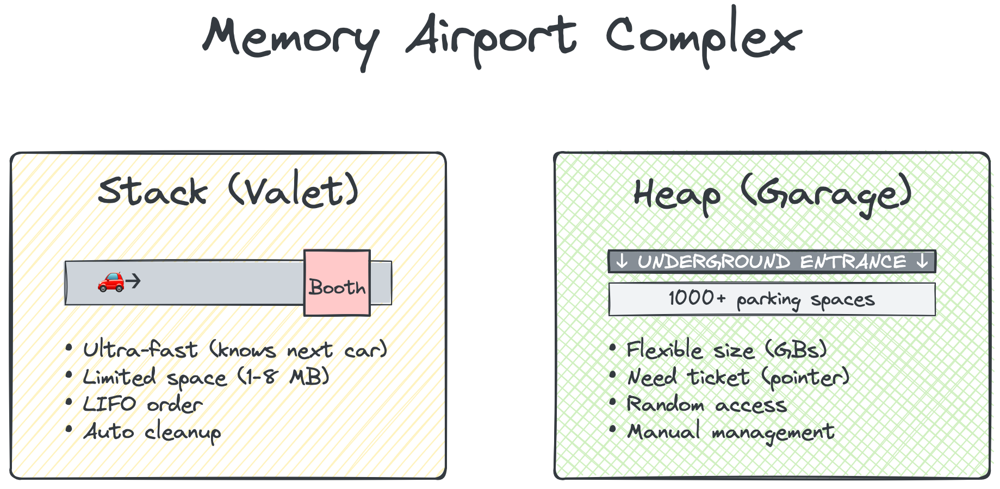
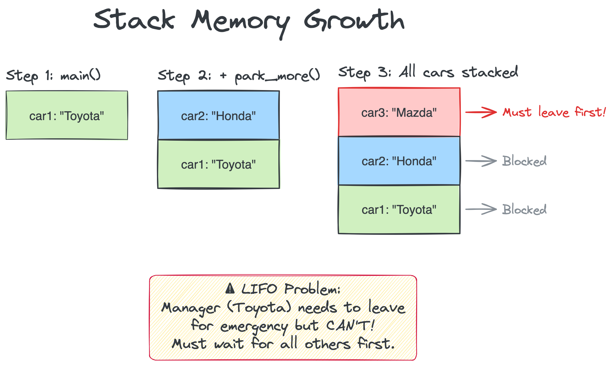
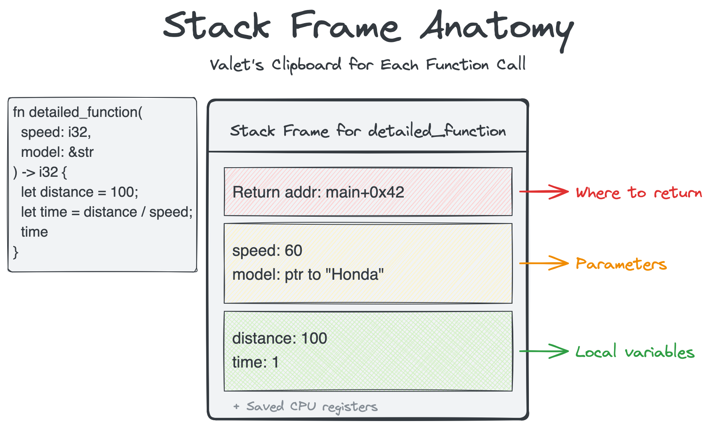
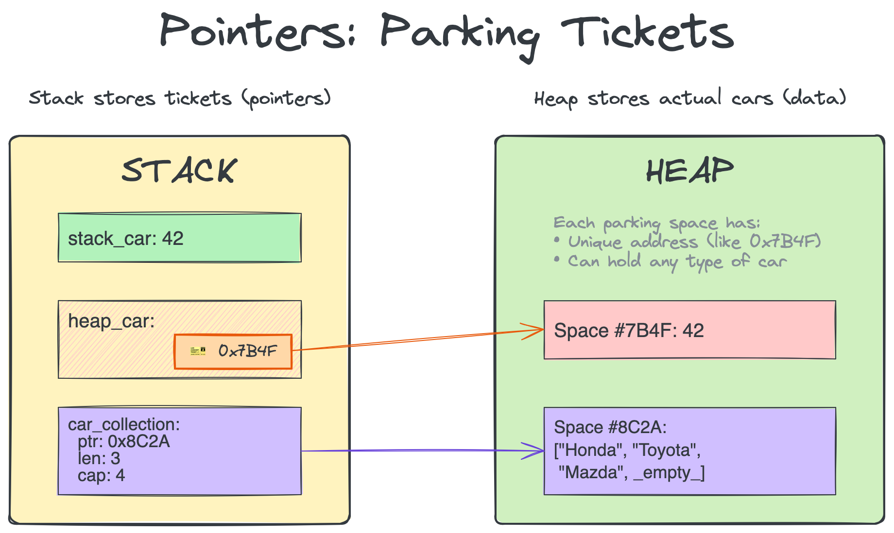
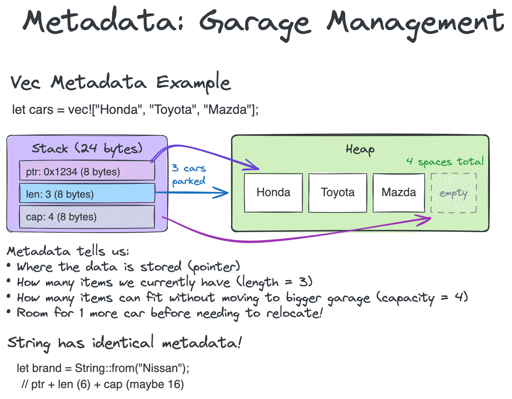

# Memory Model

## Table of Contents

- [Introduction](#introduction)
- [Stack vs Heap: Two Parking Systems](#stack-vs-heap-two-parking-systems)
  - [The Stack: Valet Parking](#the-stack-valet-parking)
  - [The Heap: Self-Park Garage](#the-heap-self-park-garage)
- [Memory Addresses and Pointers](#memory-addresses-and-pointers)
- [Rust's Memory Management](#rusts-memory-management)
  - [Ownership](#ownership)
  - [Borrowing](#borrowing)
  - [Lifetimes](#lifetimes)
- [Memory Layout in Practice](#memory-layout-in-practice)
- [Common Memory Issues](#common-memory-issues)
- [Practical Examples](#practical-examples)
- [Key Takeaways](#key-takeaways)

## Introduction

Think of your computer's memory as a massive parking complex for a busy airport.
Every piece of data needs a parking spot, and how we organize this parking
makes the difference between smooth operations and complete chaos. Let's explore
how Rust manages this parking system to keep your data safe and accessible.

## Stack vs Heap: Two Parking Systems

Your program has access to two different parking systems, each with its own
rules and benefits.



### The Stack: Valet Parking

The stack works like valet parking at a fancy hotel. Cars line up in a single
lane, and the valet can only access the car at the front. When you need your
car back, all the cars that arrived after yours must leave first.

```rust
fn main() {
    let car1 = "Toyota";        // First car arrives
    park_more_cars();           // More cars stack up
    // car1 is stuck until all other cars leave!
}

fn park_more_cars() {
    let car2 = "Honda";         // Blocks car1
    let car3 = "Ford";          // Blocks car2 and car1
    // car3 leaves first, then car2, then we return to main
}
```

Here's what the stack looks like:

```
Stack Memory (growing downward):
┌─────────────────┐
│ car3: "Ford"    │ ← Top (current)
├─────────────────┤
│ car2: "Honda"   │ ← Blocked
├─────────────────┤
│ car1: "Toyota"  │ ← Blocked
└─────────────────┘
```



**Stack properties:**

- **Ultra-fast access** - Valet knows exactly where the next car is
- **Limited space** - Usually 1-8 MB (small parking lane)
- **Automatic cleanup** - Cars removed when function ends
- **LIFO order** - Last In, First Out

### Stack Frames Explained

A stack frame is like a parking valet's clipboard for each car. When a function
is called, the valet creates a new clipboard (stack frame) that contains:

```rust
fn detailed_function(speed: i32, model: &str) -> i32 {
    let distance = 100;
    let time = distance / speed;
    time
}

// When this function is called, its stack frame contains:
// 1. Return address (where to go back after function ends)
// 2. Function parameters (speed, model)
// 3. Local variables (distance, time)
// 4. Saved registers (CPU state)
```

Stack frame visualization:

```
┌─────────────────────────┐
│ Stack Frame for         │
│ detailed_function:      │
├─────────────────────────┤
│ Return addr: main+0x42  │ ← Where to return
│ speed: 60               │ ← Parameter
│ model: ptr to "Honda"   │ ← Parameter
│ distance: 100           │ ← Local variable
│ time: 1                 │ ← Local variable
└─────────────────────────┘
```



### The Heap: Self-Park Garage

The heap is like a massive multi-level parking garage where you can park
anywhere that's free. You get a ticket (pointer) telling you exactly where
your car is parked.

```rust
fn main() {
    // Park in the garage and get a ticket
    let my_car = Box::new(String::from("Mazda"));
    
    // The ticket (Box) tells us where in the garage our car is
    println!("Car parked at location: {:p}", &my_car);
    
    // We can create more complex structures
    let mut car_collection = Vec::new();
    car_collection.push("Nissan");
    car_collection.push("Subaru");
    // Vec automatically manages parking spaces as we add cars
}
```

**Heap properties:**

- **Flexible sizing** - Can park as many cars as the garage can hold
- **Random access** - Go directly to any car with its ticket
- **Manual management** - Must remember to retrieve your car
- **Slightly slower** - Need to follow the ticket to find the car

## Memory Addresses and Pointers

Every parking space has a unique number (memory address). A pointer is just
a ticket that tells you which space to go to.

```rust
fn demonstrate_pointers() {
    // Park on stack - we know the exact spot
    let stack_car = 42;
    let stack_address = &stack_car;
    
    // Park on heap - we get a ticket
    let heap_car = Box::new(42);
    
    println!("Stack car at space: {:p}", stack_address);
    println!("Heap car at space: {:p}", &*heap_car);
    println!("Ticket itself stored at: {:p}", &heap_car);
}
```

Visual representation:

```
STACK                          HEAP
┌──────────────┐              ┌──────────────────┐
│ stack_car: 42│              │ Space #7B4F:     │
│              │              │   Value: 42      │
│ heap_car:    │              │                  │
│  [ticket]────┼─────────────→│                  │
└──────────────┘              └──────────────────┘
```



## Rust's Memory Management

### Ownership

Each car can have only one owner at a time. When ownership transfers, the
original owner can no longer access the car.

```rust
fn ownership_demo() {
    let car1 = String::from("Lexus");
    let car2 = car1;  // Ownership transferred to car2
    
    // println!("{}", car1);  // Error! car1 no longer owns the Lexus
    println!("{}", car2);     // car2 is the new owner
    
    // For simple types, we make a copy instead
    let spot1 = 42;
    let spot2 = spot1;  // Copy made, both valid
    println!("Both valid: {} and {}", spot1, spot2);
}
```

### Borrowing

Sometimes you need to let someone else use your car temporarily without
giving up ownership - like lending your keys.

```rust
fn borrowing_demo() {
    let mut my_car = String::from("Toyota");
    
    // Immutable borrow - multiple people can look
    let viewer1 = &my_car;
    let viewer2 = &my_car;
    println!("Viewers see: {} and {}", viewer1, viewer2);
    
    // Mutable borrow - only one person can modify
    let mechanic = &mut my_car;
    mechanic.push_str(" Camry");
    
    // Can't use viewers while mechanic has the car
    // println!("{}", viewer1);  // Error!
}
```

### Lifetimes

Rust ensures you never use a parking ticket after the car has been removed.

```rust
fn lifetime_example() {
    let ticket;
    {
        let temporary_car = String::from("Rental");
        ticket = &temporary_car;
    } // temporary_car is returned to rental company
    
    // println!("{}", ticket);  // Error! Car no longer exists
}
```

## Memory Layout in Practice

Different data structures use memory in different patterns:

```rust
// Fixed array - like reserved parking spaces
let reserved_spots = [1, 2, 3, 4, 5];
// Memory: [1][2][3][4][5] - all contiguous

// Vector - expandable parking section
let mut dynamic_lot = vec![1, 2, 3];
// Stack: [pointer, length=3, capacity=4]
// Heap:  [1][2][3][_] - room for growth

// String - similar to Vector
let message = String::from("Hello");
// Stack: [pointer, length=5, capacity=5]
// Heap:  ['H']['e']['l']['l']['o']
```

### Understanding Metadata

Metadata is like the parking garage's management information. For dynamic types
like Vec and String, Rust stores extra info on the stack:

```rust
// Vec metadata breakdown
let cars = vec!["Honda", "Toyota", "Mazda"];

// On the stack (24 bytes total on 64-bit systems):
// - pointer: 8 bytes - address where data lives on heap
// - length: 8 bytes - how many items currently stored (3)
// - capacity: 8 bytes - how many items can fit without reallocation (maybe 4)

// String metadata is identical:
let brand = String::from("Nissan");
// - pointer: 8 bytes - where the text is in heap
// - length: 8 bytes - how many bytes of text (6)
// - capacity: 8 bytes - allocated space (maybe 16)
```

Visual representation of Vec metadata:

```
STACK (metadata)              HEAP (actual data)
┌──────────────┐             ┌─────────────────────┐
│ ptr: 0x1234  │────────────→│ "Honda"             │
│ len: 3       │             │ "Toyota"            │
│ cap: 4       │             │ "Mazda"             │
└──────────────┘             │ [empty slot]        │
                             └─────────────────────┘
```



Comparison table:

| Type | Stack Storage | Heap Storage | When to Use |
|------|--------------|--------------|-------------|
| `i32` | Value (4 bytes) | None | Simple values |
| `[i32; 5]` | All values (20 bytes) | None | Fixed collections |
| `Vec<i32>` | Pointer + metadata (24 bytes) | Actual data | Growing collections |
| `Box<i32>` | Pointer (8 bytes) | Value (4 bytes) | Single heap values |
| `String` | Pointer + metadata (24 bytes) | Text data | Text manipulation |

## Common Memory Issues

### Stack Overflow

When the valet lane gets completely full:

```rust
fn cause_overflow() {
    let huge_array = [0u8; 1_000_000];  // Too big for stack!
    cause_overflow();  // Recursive call fills up stack
}
```

### Memory Leak

When cars are abandoned in the garage:

```rust
use std::mem;

fn create_leak() {
    let car = Box::new(String::from("Honda Civic"));
    mem::forget(car);  // Deliberately forget to clean up
    // Car stays in garage forever!
}
```

### Dangling Pointer

Using a parking ticket after the car is gone:

```rust
fn dangling_reference() -> &'static str {
    let temporary = String::from("Gone soon");
    &temporary  // Error! Can't return ticket to car that will be removed
}
```

## Practical Examples

### Smart Memory Usage

```rust
// Example: Processing large datasets efficiently
fn process_data(size: usize) {
    // Small data: use stack
    if size < 100 {
        let data = [0; 100];  // Stack allocation
        // Process...
    } else {
        // Large data: use heap
        let data = vec![0; size];  // Heap allocation
        // Process...
    }
}

// Example: Sharing data efficiently
use std::rc::Rc;

fn share_data() {
    // Multiple owners of same data
    let shared_car = Rc::new(String::from("Mitsubishi"));
    let owner1 = Rc::clone(&shared_car);
    let owner2 = Rc::clone(&shared_car);
    
    println!("Owner 1 sees: {}", owner1);
    println!("Owner 2 sees: {}", owner2);
    // Car only removed when all owners are done
}
```

### Memory-Efficient Patterns

```rust
// Return ownership instead of copying
fn create_large_data() -> Vec<i32> {
    let data = vec![1; 1000];
    data  // Move ownership to caller
}

// Use references for read-only access
fn analyze_data(data: &[i32]) -> i32 {
    data.iter().sum()  // No copy needed
}

// Use mutable references for modifications
fn update_data(data: &mut Vec<i32>) {
    data.push(42);  // Modify in place
}
```

## Key Takeaways

1. **Stack = Valet parking**: Fast but rigid, perfect for small, temporary data
2. **Heap = Parking garage**: Flexible but requires tickets (pointers)
3. **Ownership = One car, one owner**: Prevents double-parking disasters
4. **Borrowing = Temporary access**: Look but don't take
5. **Lifetimes = Valid parking period**: No expired tickets allowed

Rust's memory model might seem strict, but it's like having a well-organized
parking system - it prevents accidents and ensures everyone knows exactly where
their data is. Next, we'll explore Big O notation to understand how different
parking strategies affect performance.
