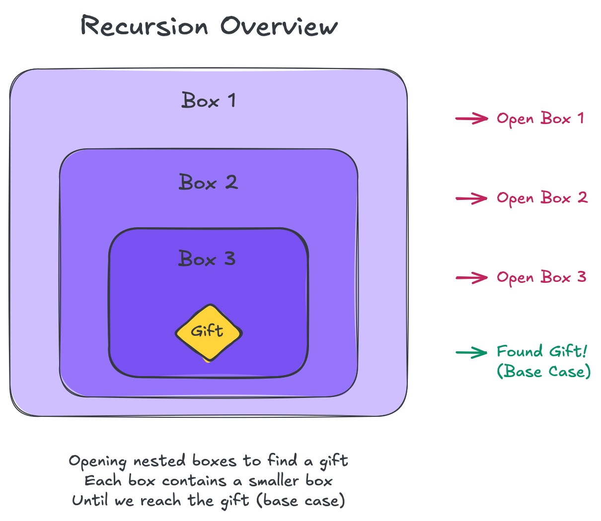
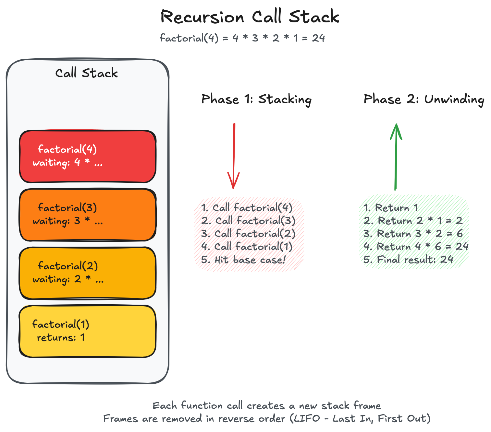
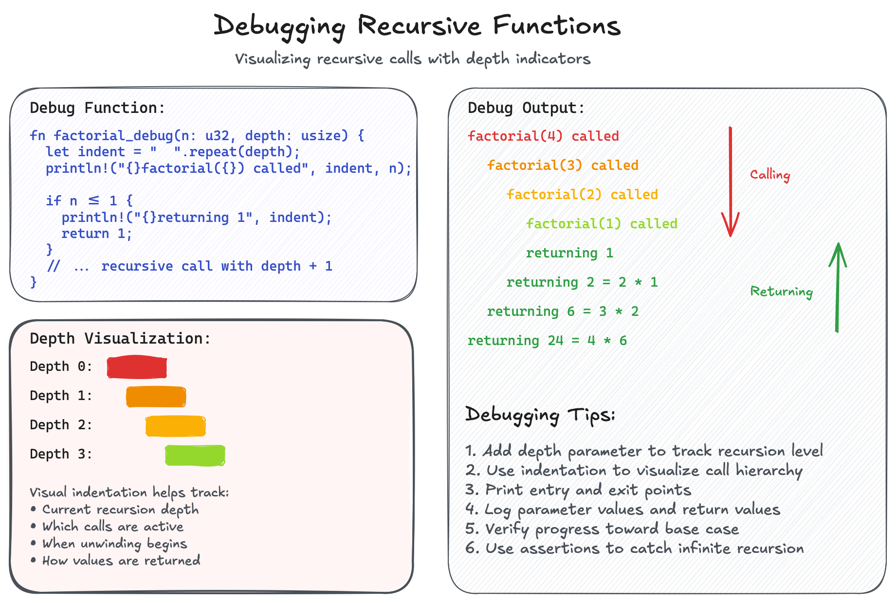

# Recursion Basics

## Table of Contents

- [Introduction](#introduction)
- [Understanding Recursion](#understanding-recursion)
  - [Real-World Analogy](#real-world-analogy)
  - [How Recursion Works](#how-recursion-works)
- [The Two Essential Parts](#the-two-essential-parts)
  - [Base Case](#base-case)
  - [Recursive Case](#recursive-case)
- [The Call Stack](#the-call-stack)
  - [Stack Frames in Action](#stack-frames-in-action)
  - [Stack Overflow](#stack-overflow)
- [Classic Examples](#classic-examples)
  - [Factorial](#factorial)
  - [Fibonacci Sequence](#fibonacci-sequence)
  - [Tree Traversal](#tree-traversal)
- [Tail Recursion](#tail-recursion)
  - [What Makes It Special](#what-makes-it-special)
  - [Tail Call Optimization](#tail-call-optimization)
- [Recursion vs Iteration](#recursion-vs-iteration)
  - [When to Use Recursion](#when-to-use-recursion)
  - [NASA's Ban on Recursion](#nasas-ban-on-recursion)
  - [Converting Between Forms](#converting-between-forms)
- [Common Patterns](#common-patterns)
  - [Linear Recursion](#linear-recursion)
  - [Binary Recursion](#binary-recursion)
  - [Multiple Recursion](#multiple-recursion)
- [Debugging Recursive Functions](#debugging-recursive-functions)
- [Practice Exercises](#practice-exercises)
- [Key Takeaways](#key-takeaways)

## Introduction

Recursion is like looking into a mirror that faces another mirror - you see
reflections within reflections, each smaller but following the same pattern.
In programming, recursion is when a function calls itself to solve smaller
instances of the same problem.



## Understanding Recursion

### Real-World Analogy

Think of recursion like opening a set of nested boxes to find a gift. You
open the first box and find another box inside. You open that box and find
yet another box. You keep opening boxes until you finally reach the smallest
box that contains the gift (the base case). Each step is the same action -
open a box - but applied to progressively smaller containers.

```rust
// Simulating nested box opening
fn open_nested_boxes(depth: u32) -> &'static str {
    println!("Opening box at depth {}", depth);
    
    if depth == 5 {                                    // Base case
        println!("Found the gift!");
        return "Gift";
    }
    
    let result = open_nested_boxes(depth + 1);        // Recursive case
    println!("Closing box at depth {}", depth);
    result
}

// Calling open_nested_boxes(1) produces:
// Opening box at depth 1
// Opening box at depth 2
// Opening box at depth 3
// Opening box at depth 4
// Opening box at depth 5
// Found the gift!
// Closing box at depth 4
// Closing box at depth 3
// Closing box at depth 2
// Closing box at depth 1
```

### How Recursion Works

Every recursive call creates a new instance of the function with its own
variables and parameters. These instances stack up until reaching the base
case, then unwind back to the original call.

```rust
// Countdown example showing the flow
fn countdown(n: i32) {
    if n <= 0 {
        println!("Blastoff!");  // Base case
    } else {
        println!("{}", n);
        countdown(n - 1);       // Recursive case
    }
}

// Calling countdown(3) produces:
// 3
// 2
// 1
// Blastoff!
```

## The Two Essential Parts

Every recursive function must have these two parts, or it will run forever:

### Base Case

The base case is the "exit door" - a condition where the function returns
without making another recursive call. Without it, you get infinite recursion.

```rust
fn sum_to_n(n: u32) -> u32 {
    if n == 0 {  // Base case: simplest possible input
        return 0;
    }
    
    n + sum_to_n(n - 1)  // Recursive case
}
```

### Recursive Case

The recursive case breaks the problem into smaller pieces and calls the
function again. Each call must move closer to the base case.

```rust
fn power(base: i32, exponent: u32) -> i32 {
    match exponent {
        0 => 1,                               // Base case
        _ => base * power(base, exponent - 1) // Recursive case
    }
}

// power(2, 3) = 2 * power(2, 2)
//             = 2 * (2 * power(2, 1))
//             = 2 * (2 * (2 * power(2, 0)))
//             = 2 * (2 * (2 * 1))
//             = 8
```

## The Call Stack

### Stack Frames in Action

Each recursive call adds a new frame to the call stack. Think of it like
stacking plates - each function call is a new plate on top.



```rust
fn factorial(n: u32) -> u32 {
    println!("Called factorial({})", n);
    
    if n <= 1 {
        println!("Returning 1 for factorial({})", n);
        return 1;
    }
    
    let result = n * factorial(n - 1);
    println!("Returning {} for factorial({})", result, n);
    result
}

// factorial(4) output:
// Called factorial(4)
// Called factorial(3)
// Called factorial(2)
// Called factorial(1)
// Returning 1 for factorial(1)
// Returning 2 for factorial(2)
// Returning 6 for factorial(3)
// Returning 24 for factorial(4)
```

### Stack Overflow

The call stack has limited space. Too many recursive calls cause a stack
overflow - like stacking plates until they topple.

```rust
// This will cause stack overflow!
fn infinite_recursion(n: i32) -> i32 {
    1 + infinite_recursion(n + 1)  // No base case!
}

// This too - even with a base case
fn bad_fibonacci(n: u64) -> u64 {
    if n <= 1 { return n; }
    bad_fibonacci(n - 1) + bad_fibonacci(n - 2)
}
// bad_fibonacci(50) makes billions of calls!
```

## Classic Examples

### Factorial

The factorial of n (written n!) is the product of all positive integers
up to n. It's a perfect recursive problem because n! = n × (n-1)!

```rust
// Recursive approach
fn factorial_recursive(n: u32) -> u32 {
    match n {
        0 | 1 => 1,
        _ => n * factorial_recursive(n - 1)
    }
}

// Iterative approach for comparison
fn factorial_iterative(n: u32) -> u32 {
    (1..=n).product()
}
```

### Fibonacci Sequence

Each number is the sum of the two before it: 0, 1, 1, 2, 3, 5, 8, 13...

```rust
// Naive recursive - O(2^n) time!
fn fibonacci_naive(n: u32) -> u32 {
    match n {
        0 => 0,
        1 => 1,
        _ => fibonacci_naive(n - 1) + fibonacci_naive(n - 2)
    }
}

// Better: with memoization - O(n) time
use std::collections::HashMap;

fn fibonacci_memo(n: u32, cache: &mut HashMap<u32, u32>) -> u32 {
    if let Some(&result) = cache.get(&n) {
        return result;
    }
    
    let result = match n {
        0 => 0,
        1 => 1,
        _ => fibonacci_memo(n - 1, cache) + fibonacci_memo(n - 2, cache)
    };
    
    cache.insert(n, result);
    result
}
```

### Tree Traversal

Trees are naturally recursive structures - each subtree is itself a tree.

```rust
#[derive(Debug)]
struct TreeNode<T> {
    value: T,
    left: Option<Box<TreeNode<T>>>,
    right: Option<Box<TreeNode<T>>>,
}

impl<T> TreeNode<T> {
    // Count nodes in tree
    fn count_nodes(&self) -> usize {
        1 + self.left.as_ref().map_or(0, |node| node.count_nodes())
          + self.right.as_ref().map_or(0, |node| node.count_nodes())
    }
    
    // Find tree height
    fn height(&self) -> usize {
        let left_height = self.left.as_ref().map_or(0, |node| node.height());
        let right_height = self.right.as_ref().map_or(0, |node| node.height());
        1 + left_height.max(right_height)
    }
}

// In-order traversal
impl<T: std::fmt::Display> TreeNode<T> {
    fn print_in_order(&self) {
        if let Some(left) = &self.left {
            left.print_in_order();
        }
        print!("{} ", self.value);
        if let Some(right) = &self.right {
            right.print_in_order();
        }
    }
}
```

## Tail Recursion

### What Makes It Special

Tail recursion is when the recursive call is the very last operation in
the function. There's nothing left to do after the recursive call returns.

```rust
// NOT tail recursive - multiplication happens after recursive call
fn factorial_not_tail(n: u32) -> u32 {
    if n <= 1 { return 1; }
    n * factorial_not_tail(n - 1)  // Still need to multiply after call
}

// Tail recursive - accumulator pattern
fn factorial_tail(n: u32, accumulator: u32) -> u32 {
    if n <= 1 { 
        return accumulator; 
    }
    factorial_tail(n - 1, n * accumulator)  // Nothing after recursive call
}

// Helper function for cleaner interface
fn factorial(n: u32) -> u32 {
    factorial_tail(n, 1)
}
```

### Tail Call Optimization

Some languages optimize tail recursion by reusing the current stack frame
instead of creating new ones. This prevents stack overflow and makes
recursion as efficient as loops.

```rust
// Tail recursive sum
fn sum_tail_recursive(n: u32, acc: u32) -> u32 {
    if n == 0 {
        acc
    } else {
        sum_tail_recursive(n - 1, acc + n)
    }
}

// Unfortunately, Rust doesn't guarantee tail call optimization
// So for large inputs, prefer iteration:
fn sum_iterative(n: u32) -> u32 {
    (1..=n).sum()
}
```

## Recursion vs Iteration

### When to Use Recursion

Recursion shines when:

- The problem is naturally recursive (trees, fractals, divide-and-conquer)
- The code is clearer and more elegant than iteration
- The depth is limited and stack overflow isn't a concern

```rust
// Directory traversal - naturally recursive
use std::fs;
use std::path::Path;

fn count_files(path: &Path) -> std::io::Result<usize> {
    let mut count = 0;
    
    if path.is_dir() {
        for entry in fs::read_dir(path)? {
            let entry = entry?;
            let path = entry.path();
            
            if path.is_dir() {
                count += count_files(&path)?;  // Recursive call
            } else {
                count += 1;
            }
        }
    }
    
    Ok(count)
}
```

### NASA's Ban on Recursion

NASA's JPL (Jet Propulsion Laboratory) explicitly prohibits recursion in
their "Power of Ten" rules for safety-critical code. Rule #1 states:
"Avoid complex flow constructs, such as goto and recursion."

Why does NASA ban recursion? In spacecraft and mission-critical systems:

1. **Unpredictable Stack Usage**: Recursion depth depends on input data,
   making it impossible to guarantee stack bounds at compile time.

2. **No Stack Overflow Recovery**: In space, a stack overflow means mission
   failure. There's no way to recover or reboot safely.

3. **Static Analysis Difficulty**: Tools can't easily prove recursion will
   terminate or calculate maximum stack usage.

4. **Real-Time Constraints**: Recursive algorithms have unpredictable
   execution times, breaking real-time guarantees.

```rust
// NASA would reject this code
fn process_sensor_data(depth: u32) -> u32 {
    if depth > 100 { return 0; }  // Still risky!
    process_sensor_data(depth + 1)
}

// NASA prefers explicit loops with bounded iterations
fn process_sensor_data_safe(max_depth: u32) -> u32 {
    let mut result = 0;
    for depth in 0..max_depth.min(100) {  // Guaranteed bounds
        // Process data
        result += 1;
    }
    result
}
```

This doesn't mean recursion is bad - it means different domains have
different requirements. Web apps can handle occasional stack overflows;
Mars rovers cannot.

### Converting Between Forms

Most recursive solutions can be converted to iterative ones using explicit
stacks or queues.

```rust
// Recursive reverse
fn reverse_list_recursive<T>(list: &[T]) -> Vec<T> 
where 
    T: Clone 
{
    match list {
        [] => vec![],
        [first, rest @ ..] => {
            let mut reversed = reverse_list_recursive(rest);
            reversed.push(first.clone());
            reversed
        }
    }
}

// Iterative reverse (more efficient)
fn reverse_list_iterative<T>(list: &[T]) -> Vec<T>
where
    T: Clone
{
    let mut reversed = Vec::with_capacity(list.len());
    for item in list.iter().rev() {
        reversed.push(item.clone());
    }
    reversed
}

// Using explicit stack for tree traversal
fn count_nodes_iterative<T>(root: Option<&TreeNode<T>>) -> usize {
    let mut stack = vec![];
    let mut count = 0;
    
    if let Some(node) = root {
        stack.push(node);
    }
    
    while let Some(node) = stack.pop() {
        count += 1;
        
        if let Some(left) = &node.left {
            stack.push(left);
        }
        if let Some(right) = &node.right {
            stack.push(right);
        }
    }
    
    count
}
```

## Common Patterns

### Linear Recursion

Processes a list element by element, making one recursive call per step.

```rust
// Sum of list elements
fn sum_list(numbers: &[i32]) -> i32 {
    match numbers {
        [] => 0,
        [first, rest @ ..] => first + sum_list(rest)
    }
}

// Find maximum
fn max_list(numbers: &[i32]) -> Option<i32> {
    match numbers {
        [] => None,
        [single] => Some(*single),
        [first, rest @ ..] => {
            let rest_max = max_list(rest)?;
            Some((*first).max(rest_max))
        }
    }
}
```

### Binary Recursion

Makes two recursive calls, often splitting the problem in half.

```rust
// Merge sort
fn merge_sort<T: Ord + Clone>(arr: &[T]) -> Vec<T> {
    if arr.len() <= 1 {
        return arr.to_vec();
    }
    
    let mid = arr.len() / 2;
    let left = merge_sort(&arr[..mid]);
    let right = merge_sort(&arr[mid..]);
    
    merge(&left, &right)
}

fn merge<T: Ord + Clone>(left: &[T], right: &[T]) -> Vec<T> {
    let mut result = Vec::with_capacity(left.len() + right.len());
    let mut left_idx = 0;
    let mut right_idx = 0;
    
    while left_idx < left.len() && right_idx < right.len() {
        if left[left_idx] <= right[right_idx] {
            result.push(left[left_idx].clone());
            left_idx += 1;
        } else {
            result.push(right[right_idx].clone());
            right_idx += 1;
        }
    }
    
    result.extend_from_slice(&left[left_idx..]);
    result.extend_from_slice(&right[right_idx..]);
    result
}
```

### Multiple Recursion

Makes multiple recursive calls, exploring all possibilities.

```rust
// Generate all subsets
fn subsets<T: Clone>(items: &[T]) -> Vec<Vec<T>> {
    match items {
        [] => vec![vec![]],
        [first, rest @ ..] => {
            let without_first = subsets(rest);
            let with_first: Vec<_> = without_first
                .iter()
                .map(|subset| {
                    let mut new_subset = vec![first.clone()];
                    new_subset.extend(subset.clone());
                    new_subset
                })
                .collect();
            
            [without_first, with_first].concat()
        }
    }
}

// Generate permutations
fn permutations<T: Clone>(items: &[T]) -> Vec<Vec<T>> {
    if items.is_empty() {
        return vec![vec![]];
    }
    
    let mut result = Vec::new();
    
    for i in 0..items.len() {
        let mut remaining = items.to_vec();
        let current = remaining.remove(i);
        
        for mut perm in permutations(&remaining) {
            perm.insert(0, current.clone());
            result.push(perm);
        }
    }
    
    result
}
```

## Debugging Recursive Functions

Debugging recursion can be tricky. Here are helpful techniques:

```rust
// Add depth parameter for visualization
fn factorial_debug(n: u32, depth: usize) -> u32 {
    let indent = "  ".repeat(depth);
    println!("{}factorial({}) called", indent, n);
    
    let result = if n <= 1 {
        println!("{}returning 1 (base case)", indent);
        1
    } else {
        let sub_result = factorial_debug(n - 1, depth + 1);
        let result = n * sub_result;
        println!("{}returning {} = {} * {}", indent, result, n, sub_result);
        result
    };
    
    result
}

// Add assertion to verify progress toward base case
fn safe_recursive_function(n: i32, previous: Option<i32>) -> i32 {
    // Ensure we're making progress
    if let Some(prev) = previous {
        assert!(n < prev, "Not making progress toward base case!");
    }
    
    if n <= 0 {
        return 0;
    }
    
    1 + safe_recursive_function(n - 1, Some(n))
}
```



## Practice Exercises

### Exercise 1: Palindrome Checker

Write a recursive function to check if a string is a palindrome.

```rust
// Starter code
fn is_palindrome(s: &str) -> bool {
    // Your implementation here
    todo!()
}

// Tests
assert!(is_palindrome("racecar"));
assert!(is_palindrome("a"));
assert!(!is_palindrome("hello"));
```

### Exercise 2: Binary Search

Implement binary search recursively.

```rust
fn binary_search(arr: &[i32], target: i32) -> Option<usize> {
    // Your implementation here
    todo!()
}

// Should return Some(index) if found, None otherwise
```

### Exercise 3: Flatten Nested List

Flatten a nested list structure recursively.

```rust
enum NestedList<T> {
    Value(T),
    List(Vec<NestedList<T>>),
}

fn flatten<T: Clone>(nested: &NestedList<T>) -> Vec<T> {
    // Your implementation here
    todo!()
}
```

### Exercise 4: Tower of Hanoi

Solve the Tower of Hanoi puzzle recursively.

```rust
fn hanoi(n: u32, from: char, to: char, aux: char) {
    // Print moves to solve Tower of Hanoi
    todo!()
}
```

## Key Takeaways

1. **Recursion = Self-Reference**: A function calling itself to solve
   smaller instances of the same problem

2. **Always Have a Base Case**: Without it, you'll get infinite recursion
   and stack overflow

3. **Make Progress**: Each recursive call must move closer to the base case

4. **Stack Space Matters**: Each call uses stack space - deep recursion
   can cause overflow

5. **Not Always Best**: Iteration is often more efficient for simple loops

6. **Natural for Trees**: Recursive data structures like trees are best
   processed recursively

7. **Tail Recursion**: When possible, make the recursive call the last
   operation

8. **Debug with Depth**: Add depth parameters and logging to understand
   recursive flow

Remember: Recursion is a powerful tool, but like any tool, use it when
it makes the solution clearer and more elegant, not just because you can!
