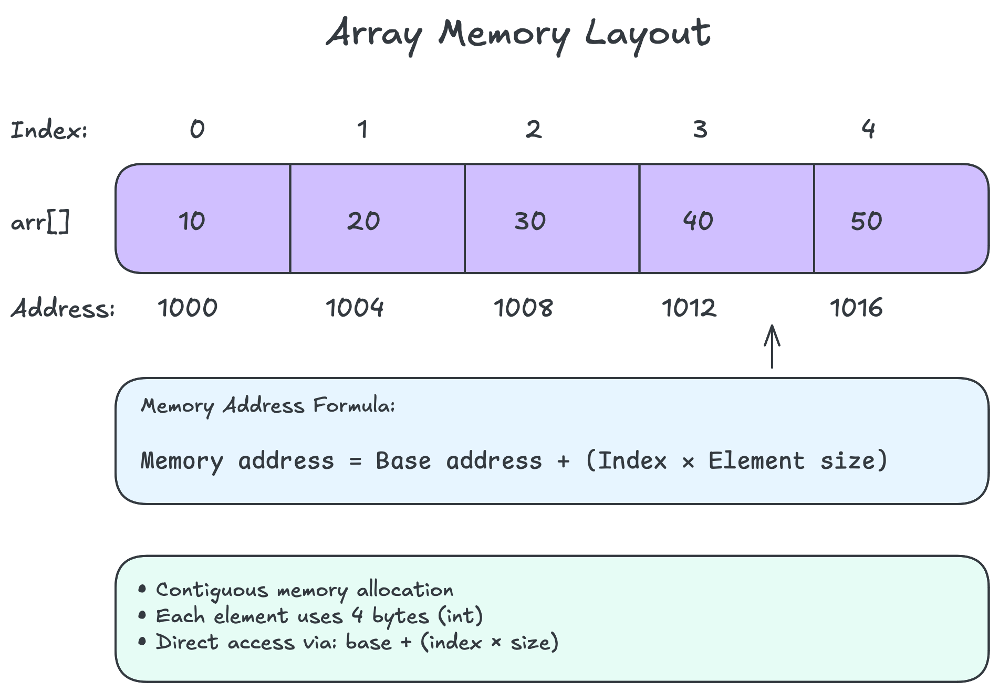

# Arrays Data Structure

## Table of Contents

- [Overview](#overview)
- [What You'll Learn](#what-youll-learn)
- [Prerequisites](#prerequisites)
- [Structure](#structure)
- [Theory First](#theory-first)
- [Practical Implementation](#practical-implementation)
- [Algorithms Covered](#algorithms-covered)
- [Problem-Solving](#problem-solving)
- [Visual Learning](#visual-learning)
- [Next Steps](#next-steps)

## Overview

Arrays are the foundation of computer science - contiguous memory storage
with constant-time access. If data structures were a toolbox, arrays would
be the hammer - simple, versatile, and used everywhere.

Think of an array like a row of mailboxes in an apartment building. Each
mailbox has a number, holds exactly one package, and you can access any
mailbox directly if you know its number.

## What You'll Learn

By the end of this section, you'll understand:

- How arrays work at the memory level
- The difference between static and dynamic arrays
- Time and space complexity of array operations
- When to use arrays vs other data structures
- Common array algorithms and their applications
- Real-world use cases across different domains

## Prerequisites

Before diving into arrays, make sure you're comfortable with:

- [What Are Data Structures?](../00-fundamentals/what-are-data-structures.md)
- [Memory Model](../00-fundamentals/memory-model.md) - especially stack vs heap
- [Big O Notation](../00-fundamentals/big-o-notation.md) - for complexity analysis

## Structure

This section is organized to build your understanding progressively:

### Theory First

1. **[Core Theory](./theory.md)** - Understand how arrays work
   - Memory layout and allocation
   - Static vs dynamic arrays
   - Time and space complexity
   - Operations and their costs

2. **[Use Cases](./use-cases.md)** - See arrays in action
   - Image processing
   - Game development
   - Scientific computing
   - System programming

### Practical Implementation

3. **[Rust Implementation](./implementations/rust/)** - Hands-on coding
   - Basic array operations
   - Dynamic arrays (Vectors)
   - Custom implementations
   - Performance considerations

### Algorithms Covered

4. **[Array Algorithms](./algorithms/)**
   - Linear search
   - Binary search
   - Sorting algorithms
   - Two-pointer techniques
   - Sliding window

### Problem-Solving

5. **Practice Problems** (by difficulty)
   - **Easy**: Array reversal, finding maximum
   - **Medium**: Rotating arrays, product except self
   - **Hard**: Median of sorted arrays

## Visual Learning

Each concept includes diagrams to help visualize:

- Memory layout diagrams
- Operation animations
- Algorithm step-by-step visualizations
- Performance comparisons

## Next Steps

After mastering arrays, you'll be ready for:

1. **[Linked Lists](../02-linked-lists/)** - When dynamic size matters more
2. **[Stacks](../03-stacks/)** - Arrays with LIFO access pattern
3. **[Queues](../04-queues/)** - Arrays with FIFO access pattern
4. **[Hash Tables](../07-hash-tables/)** - Arrays + hash functions

## Quick Reference

| Operation | Time Complexity | Space Complexity |
|-----------|----------------|------------------|
| Access | O(1) | O(1) |
| Search | O(n) | O(1) |
| Insert (end) | O(1)* | O(1) |
| Insert (arbitrary) | O(n) | O(1) |
| Delete (end) | O(1) | O(1) |
| Delete (arbitrary) | O(n) | O(1) |

*Amortized for dynamic arrays

Remember: Arrays are everywhere in programming. Master them, and you'll
have a solid foundation for everything else!
