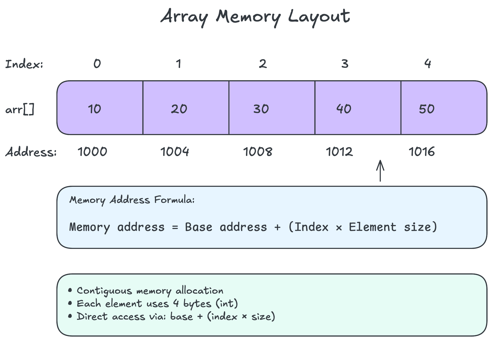

# Array Theory

## Prerequisites

- [What Are Data Structures?](../../00-fundamentals/what-are-data-structures.md)
- [Memory Model](../../00-fundamentals/memory-model.md)
- [Big O Notation](../../00-fundamentals/big-o-notation.md)

## Table of Contents

- [Introduction](#introduction)
- [The Parking Lot Analogy](#the-parking-lot-analogy)
- [Understanding Arrays Through Real Examples](#understanding-arrays-through-real-examples)
  - [Memory Layout](#memory-layout)
  - [Indexing and Access](#indexing-and-access)
  - [Size and Capacity](#size-and-capacity)
- [Technical Deep Dive](#technical-deep-dive)
  - [Static vs Dynamic Arrays](#static-vs-dynamic-arrays)
  - [Memory Allocation](#memory-allocation)
  - [Time Complexity](#time-complexity)
  - [Space Complexity](#space-complexity)
- [Array Operations](#array-operations)
  - [Access](#access)
  - [Search](#search)
  - [Insertion](#insertion)
  - [Deletion](#deletion)
- [Advantages and Disadvantages](#advantages-and-disadvantages)
- [When to Use Arrays](#when-to-use-arrays)
- [Common Pitfalls](#common-pitfalls)
- [Key Takeaways](#key-takeaways)

## Introduction

Arrays are the most fundamental data structure in computer science. They're
like the foundation of a house - simple, but everything else builds on top
of them. If you understand arrays well, you'll have an easier time with
every other data structure.

## The Parking Lot Analogy

Imagine a parking lot with numbered spaces. Each space:

- Has a specific number (0, 1, 2, 3...)
- Can hold exactly one car
- Is the same size as every other space
- Sits right next to its neighboring spaces

This is exactly how arrays work in computer memory. Each "parking space" is
a memory location that can hold one piece of data.



## Understanding Arrays Through Real Examples

### Memory Layout

Arrays store elements in contiguous memory locations, like apartments on the
same floor of a building - all the same size and right next to each other.
This enables constant-time access through simple address calculation.

For detailed understanding of memory layout, alignment, and allocation, see
[Memory Management Guide](../implementations/rust/docs/memory-management.md).

### Size and Capacity

Arrays come in two flavors (see [implementations](./implementations/rust/src/) for code):

**Static Arrays** (like a pre-built apartment complex):

- Size is fixed when created
- Can't add more apartments
- Memory efficient if you know the exact size needed

**Dynamic Arrays** (like a expandable office building):

- Can grow when needed
- Actually creates a bigger array and copies everything over
- Like moving to a bigger office when you outgrow the current one


## Technical Deep Dive

### Static vs Dynamic Arrays

**Static Arrays:**

```rust
// In Rust, regular arrays are static
let numbers: [i32; 5] = [1, 2, 3, 4, 5];
// Size is part of the type - can't change
```

**Dynamic Arrays (Vectors in Rust):**

```rust
// Vectors can grow and shrink
let mut numbers = vec![1, 2, 3];
numbers.push(4); // Now it has 4 elements
```

### Memory Allocation

When you create an array, the system:

1. Finds a contiguous block of memory
2. Reserves it for your exclusive use
3. Returns the starting address

It's like reserving a row of seats at a movie theater - they must be
together, not scattered around.

### Time Complexity

| Operation | Time Complexity | Why? |
|-----------|----------------|------|
| Access by index | O(1) | Direct address calculation |
| Search (unsorted) | O(n) | Must check each element |
| Search (sorted) | O(log n) | Can use binary search |
| Insert at end | O(1)* | Just add to next spot |
| Insert at beginning | O(n) | Must shift everything |
| Delete from end | O(1) | Just remove last |
| Delete from beginning | O(n) | Must shift everything |

*Amortized for dynamic arrays - occasionally O(n) when resizing

### Space Complexity

Arrays have O(n) space complexity where n is the number of elements. But
there's more to consider:

- **Static arrays**: Exactly n × element_size bytes
- **Dynamic arrays**: Often allocate extra space for growth
  - Typical growth factor: 1.5x or 2x
  - If you have 10 elements, might allocate space for 16

#### How Dynamic Array Growth Works

Think of dynamic arrays like a growing company that needs office space:

1. **Initial allocation**: Start with space for 4 employees
2. **Fill up**: Hire 4 people, now at capacity
3. **Need to grow**: Want to hire a 5th person
4. **Find bigger space**: Can't expand current office
5. **Double the size**: Rent new office for 8 people
6. **Move everyone**: Copy all 4 employees to new office
7. **Continue**: Now have room for 4 more hires

Here's what happens in memory:

```rust
// Initial: capacity = 4, length = 3
[1, 2, 3, _, _, _, _, _]
         ^
         used space

// Push one more element
vec.push(4); // length = 4, capacity = 4 (full!)

// Push another (triggers growth)
vec.push(5); // Need to grow!

// Steps:
1. Allocate new array with capacity = 8
2. Copy elements [1,2,3,4] to new array  
3. Add new element 5
4. Deallocate old array

// Result: capacity = 8, length = 5
[1, 2, 3, 4, 5, _, _, _]
               ^
               room to grow
```

**Growth strategies**:

- **2x growth**: Simple but can waste memory (Java, Python)
- **1.5x growth**: Better memory usage (C++)
- **Rust's Vec**: 0 → 1 → 2 → 4 → 8 → 16 → 32 → 64 → ...

This is why push() is O(1) amortized - most pushes are cheap, but
occasionally you pay O(n) to resize. Over many operations, it averages
out to O(1) per push. See [Dynamic Array Strategies](./implementations/rust/docs/dynamic-array-strategies.md)
for detailed analysis.


## Array Operations


### Access

Accessing an element is like looking up a specific parking spot when you
know the number:

```rust
let value = array[3]; // O(1) - instant access
```

### Search

Searching is like finding a car by its license plate in the parking lot:

**Linear Search** (checking each spot):

```rust
for (index, &item) in array.iter().enumerate() {
    if item == target {
        return Some(index);
    }
}
```

**Binary Search** (only for sorted arrays):
Like checking the middle of a phone book, then deciding which half to check
next.

### Insertion

**At the end** (easy - next empty parking spot):

```rust
array.push(new_value); // O(1) usually
```

**At the beginning or middle** (everyone needs to move over):

```rust
array.insert(0, new_value); // O(n) - expensive!
```

### Deletion

Similar to insertion - easy at the end, expensive elsewhere because elements
need to shift to fill the gap.

## Advantages and Disadvantages

### Advantages

- **Cache-friendly**: Elements are stored together, making access fast
- **Direct indexing**: O(1) access to any element
- **Memory efficient**: No extra memory for pointers
- **Simple**: Easy to understand and implement

### Disadvantages

- **Fixed size** (for static arrays)
- **Expensive insertions/deletions** (except at the end)
- **Memory must be contiguous**: Can fail if memory is fragmented
- **Wasted space**: Dynamic arrays often have unused capacity

## When to Use Arrays

Arrays are perfect when you:

- Know the size in advance (or have a good estimate)
- Need fast access to elements by position
- Do more reading than inserting/deleting
- Want cache-efficient operations
- Need to store elements of the same type

For detailed real-world applications across different domains, see
[Array Use Cases](./use-cases.md).

## Common Pitfalls

Arrays seem simple but have several common pitfalls. For a comprehensive
guide to avoiding mistakes in array implementations, see
[Common Array Implementation Pitfalls](./implementations/rust/docs/common-pitfalls.md).

Key pitfalls to remember:

- Out-of-bounds access (indices 0 to n-1)
- Not considering growth needs
- Frequent insertions at the beginning (O(n) operation)
- Memory fragmentation with large arrays
- Zero-indexing confusion

## Key Takeaways

- Arrays store elements in contiguous memory locations
- They provide O(1) access by index but O(n) for arbitrary insertions
- Static arrays are fixed-size, dynamic arrays (vectors) can grow
- They're cache-friendly and memory-efficient
- Best for scenarios with known sizes and frequent access patterns
- Foundation for many other data structures

Remember: Arrays are like parking lots - great for direct access when you
know the spot number, but reorganizing the cars is a pain!

## Next Steps

Now that you understand array theory:

1. **[Explore Use Cases](./use-cases.md)** - See arrays in real-world applications
2. **[Deep Dive: Memory Management](./implementations/rust/docs/memory-management.md)** - Understand the low-level details
3. **[Start Implementing](./exercises/rust/docs/fixed-array-guide.md)** - Build your own array from scratch
4. **[Learn Dynamic Arrays](./implementations/rust/docs/dynamic-array-strategies.md)** - Understand growth strategies
